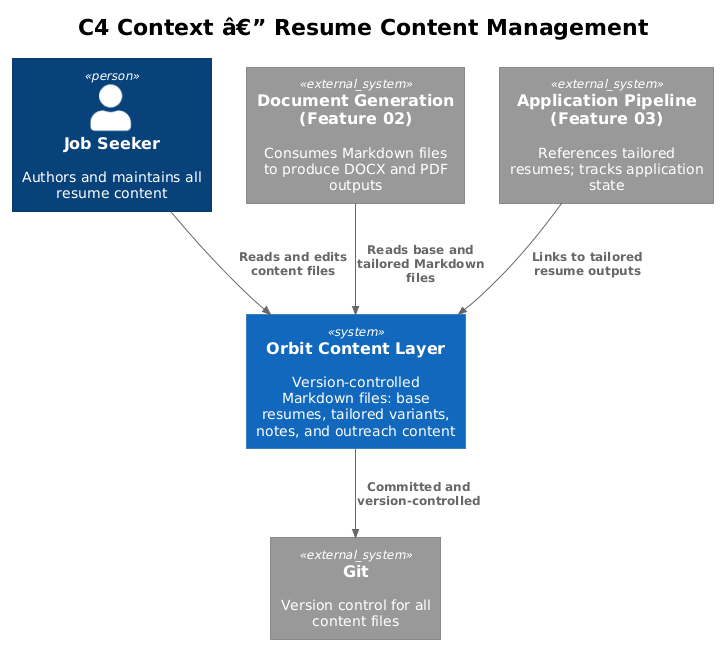
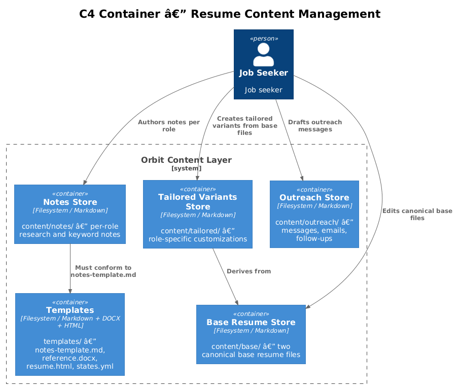
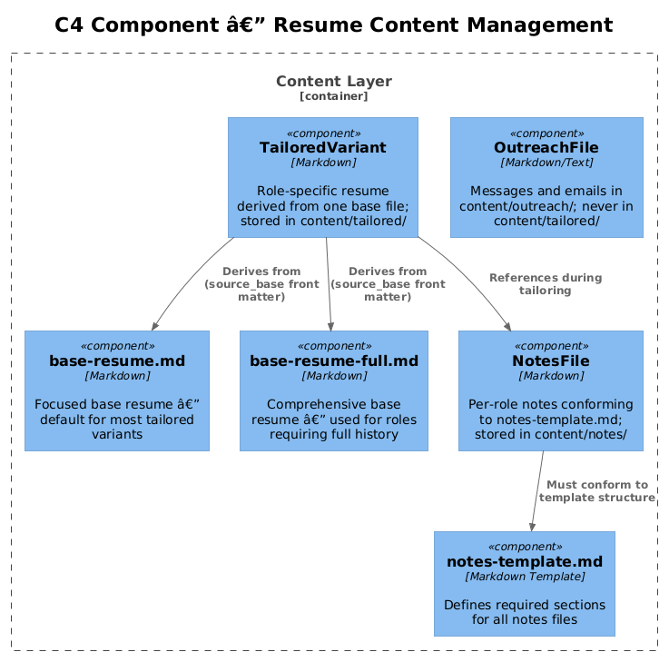
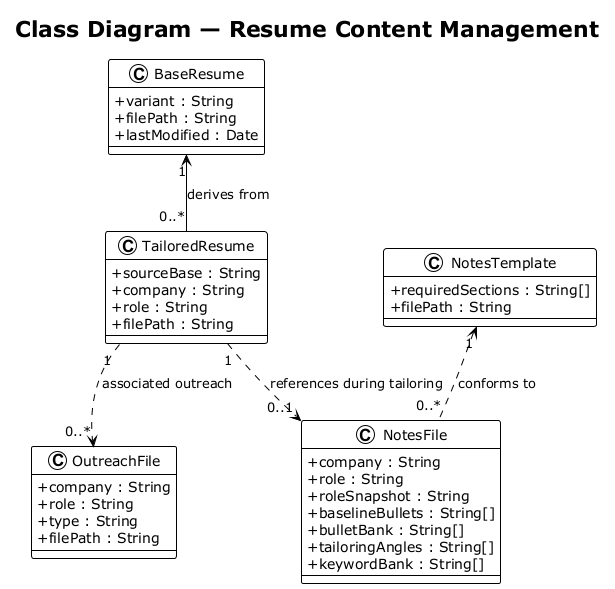
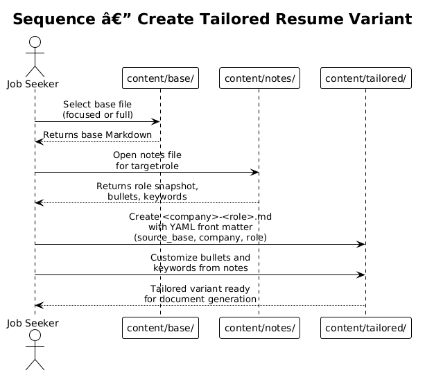
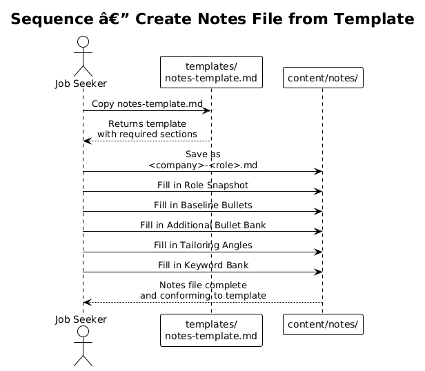

# Feature 01 — Resume Content Management — Detailed Design

## 1. Overview

This feature establishes the single source of truth for all resume content within the Orbit career management system. All resume data is stored in version-controlled Markdown files organized into base files, tailored variants, notes, and outreach content. The design enforces structural consistency through templates and naming conventions, ensuring every tailored resume is traceable to a canonical base file.

**Scope of this feature:**
- Two canonical base resume files (focused and comprehensive variants)
- Notes files conforming to a mandatory template across all tracked roles
- Outreach content segregated into its own directory, separate from tailored resumes
- Template enforcement as the mechanism for structural consistency

**Requirements satisfied:**
- L1-001: Single source of truth in version-controlled Markdown
- L2-001: Two base files, no tailored variant without a base
- L2-002: Notes files conforming to the notes template
- L2-003: Outreach files in the outreach directory, not in the tailored directory

---

## 2. Architecture

### 2.1 C4 Context Diagram

The resume content management system sits at the center of the Orbit toolset. The job seeker reads and edits content files directly. The Document Generation feature (Feature 02) consumes base and tailored Markdown files. The Application Pipeline (Feature 03) references tailored resume outputs. Git provides version control for all files.

### 2.2 C4 Container Diagram

The content layer consists of four containers: the base resume store, the tailored variants store, the notes store, and the outreach store. Templates act as a shared constraint layer referenced by all containers. All containers are directories on the local filesystem, tracked in Git.

### 2.3 C4 Component Diagram

Within the content layer, the key components are the two canonical base files, the notes template enforcer, and the outreach directory boundary enforcer. The tailored variant creation workflow depends on both the base files and notes components.

---

## 3. Component Details

### 3.1 Base Resume Store (`content/base/`)

| File | Purpose |
|---|---|
| `focused-base.md` | Focused, default resume. Used for most tailored variants. |
| `comprehensive-base.md` | Comprehensive resume. Used when a role requires full history. |

Rules:
- These are the only two permitted files in `content/base/`.
- Both files must be kept structurally consistent (verified by `scripts/verify-sync.ps1` in Feature 02).
- A tailored variant must reference exactly one of these two files as its source.

### 3.2 Tailored Variants Store (`content/tailored/`)

- One Markdown file per application, named `<company-slug>-<role-slug>.md` (lowercase, hyphens, no spaces — resolves Open Question 3).
- Each file derives from one of the two base files; the derivation source is recorded in YAML front matter.
- No outreach files (messages, email drafts) shall reside here.

### 3.3 Notes Store (`content/notes/`)

- One notes file per tracked role/company pair.
- Every file must conform to the notes template.
- Required sections: Role Snapshot, Baseline Bullets, Additional Bullet Bank, Tailoring Angles, Keyword Bank.

### 3.4 Outreach Store (`content/outreach/`)

- Contains all LinkedIn messages, email drafts, and recruiter follow-up files.
- Files named by company/role slug with a type suffix (e.g., `-linkedin-message`, `-email`, `-follow-up`).
- Migration required: any message files currently in `content/tailored/` must be moved here.

### 3.5 Templates (`templates/`)

| File | Purpose |
|---|---|
| `notes-template.md` | Canonical structure for all role/company notes files |
| `reference.docx` | Word styling reference for Pandoc (used by Feature 02) |
| `resume.html` | HTML template for PDF rendering (used by Feature 02) |
| `states.yml` | Valid application status values (used by Feature 03) |
| `offer-eval-template.md` | Structured evaluation template (used by Feature 04) |

---

## 4. Data Model

### 4.1 Class Diagram

### 4.2 Entity Descriptions

**BaseResume**
Represents one of the two canonical base files. Has a `variant` property (`focused` or `comprehensive`), a file path, and a last-modified timestamp. It is the parent of zero or more `TailoredResume` instances.

**TailoredResume**
Represents a role-specific customization derived from exactly one `BaseResume`. Contains a `sourceBase` reference, the target company name, and role title. Stored as Markdown in `content/tailored/`.

**NotesFile**
Represents a notes document for a specific company/role. Must conform to the `NotesTemplate`. Contains sections: Role Snapshot, Baseline Bullets, Bullet Bank, Tailoring Angles, Keyword Bank.

**NotesTemplate**
Defines the required section structure that all `NotesFile` instances must satisfy. Stored at `templates/notes-template.md`.

**OutreachFile**
Represents an outreach communication artifact (LinkedIn message, email draft, follow-up). Belongs to a company/role and must reside in `content/outreach/`.

---

## 5. Key Workflows

### 5.1 Create Tailored Variant

The job seeker selects the appropriate base file (focused or comprehensive), copies it to `content/tailored/` with a role-specific name, adds YAML front matter recording the source base, then customizes bullets using the corresponding notes file. The resulting Markdown file becomes the input for Feature 02 document generation.

### 5.2 Create Notes File from Template

When tracking a new role, the job seeker copies the notes template to `content/notes/<company>-<role>.md` and fills in each required section. The notes file is referenced during tailored variant creation to guide bullet selection and keyword usage.

---

## 6. API Contracts

This feature has no executable API surface. All contracts are enforced by file-system conventions and template structure. The following implicit contracts exist:

- **Front matter contract (TailoredResume):** Every tailored Markdown file must contain a YAML front matter block with at minimum: `source_base` (one of `focused-base.md` or `comprehensive-base.md`), `company`, and `role`.
- **Notes template contract:** All files in `content/notes/` must contain headings: `## Role Snapshot`, `## Baseline Bullets`, `## Additional Bullet Bank`, `## Tailoring Angles`, `## Keyword Bank`.
- **Outreach location contract:** No outreach message files shall exist under `content/tailored/`.
- **Naming convention contract:** Tailored files must match the pattern `^[a-z0-9-]+-[a-z0-9-]+\.md$`.

**Pre-commit hook (resolves Open Question 1):** A Git pre-commit hook at `.git/hooks/pre-commit` (or via `scripts/hooks/pre-commit`) validates:
1. All files staged from `content/tailored/` contain the required YAML front matter fields
2. No files staged to `content/tailored/` match known outreach name suffixes (`-linkedin-message`, `-email`, `-follow-up`)

The hook exits with code `1` and a descriptive error if either check fails, blocking the commit.

---

## 6.1 Cross-Feature Contracts

**Feature 08 → Feature 01 (Archetype-driven base resume selection):**
When Feature 08 classifies a listing as `Enterprise Contract` and sets the `RecommendBaseResume` flag, the variant creation script (Feature 09 / `new-variant.ps1`) must default to `focused-base.md` as the source base. For all other archetypes the user is prompted to confirm the base selection. This contract ensures archetype-driven guidance surfaces at variant creation time without hardcoding it in Feature 08.

---

## 7. Security Considerations

- All content files are stored locally and committed to a Git repository. Ensure the repository is **private** if it contains salary expectations, recruiter contact details, or personal compensation data in notes files.
- Outreach files may contain personal contact information (recruiter names, email addresses). These remain local and are not published.
- No secrets, API keys, or credentials belong in any content file.

---

## 8. Open Questions

| # | Question | Status |
|---|---|---|
| 1 | Should front matter in tailored variants be validated automatically by a pre-commit hook? | Open |
| 2 | Should the notes template be versioned so that older notes files can be identified as out-of-date? | Open |
| 3 | Is a naming convention enforced for tailored files (e.g., `<company>-<role-slug>.md`)? | Open |
| 4 | Should outreach files be linked from the pipeline tracker (Feature 03) for traceability? | Open |
