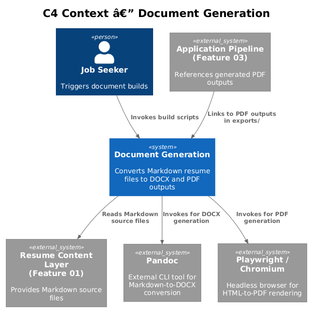
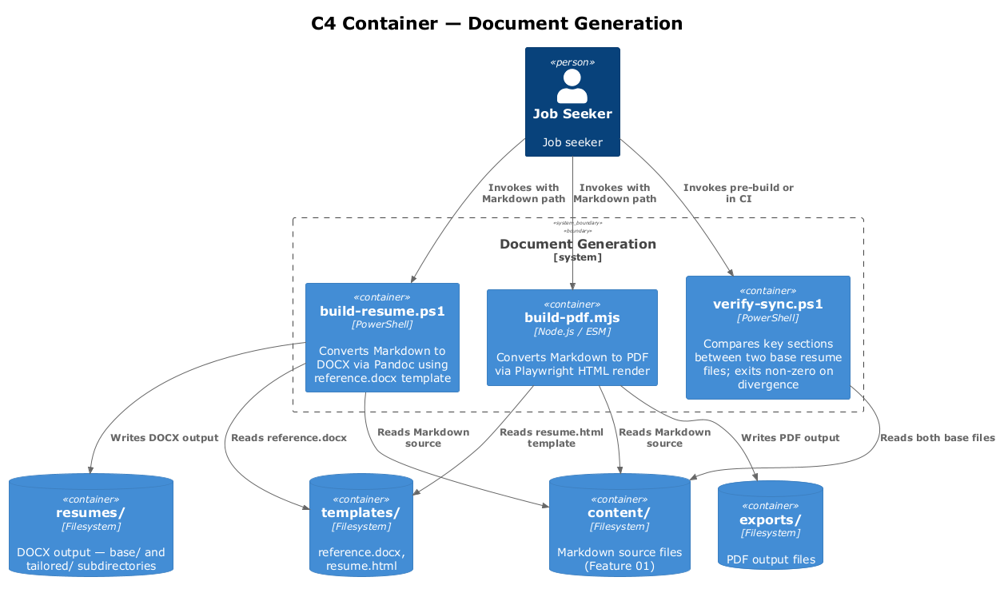
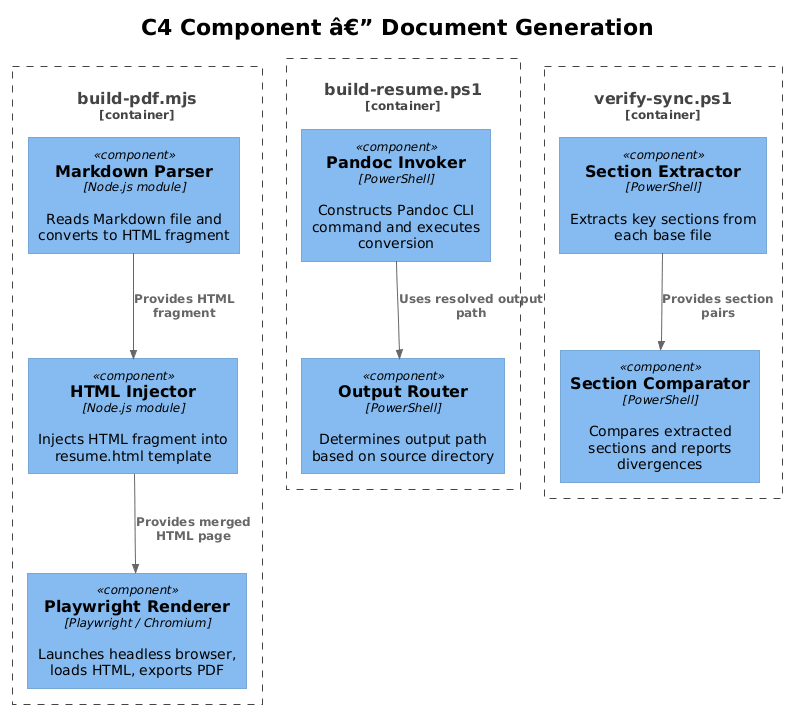
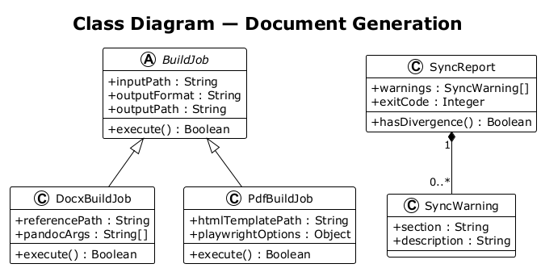
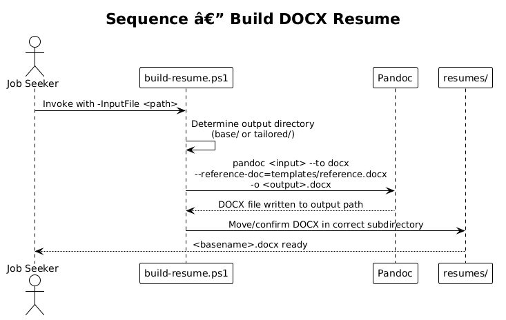
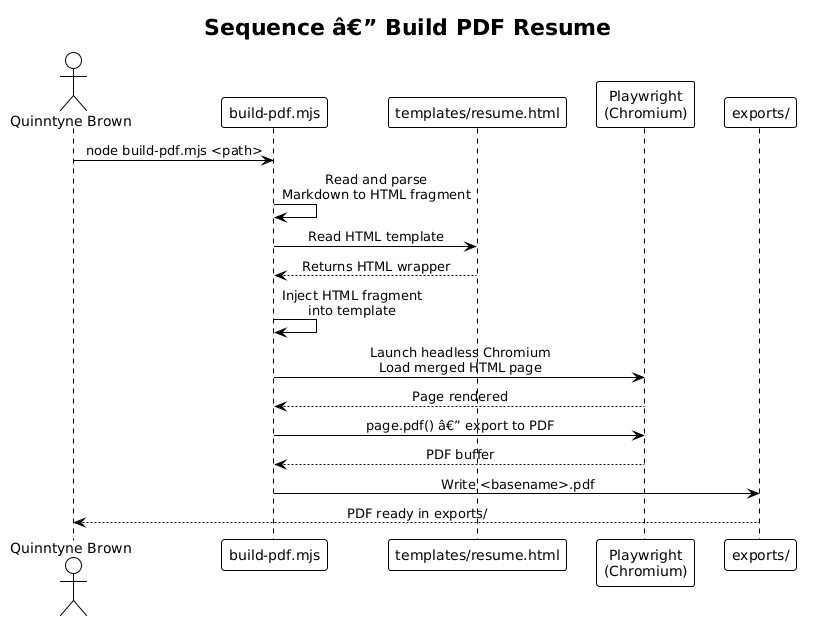
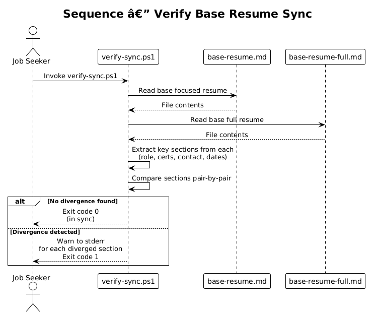

# Feature 02 — Document Generation — Detailed Design

## 1. Overview

This feature converts Markdown resume source files into professional-quality Word (.docx) and PDF outputs suitable for recruiter submission and ATS parsing. The pipeline requires no Microsoft Word installation for PDF generation. It also includes a synchronization verification script that detects divergence between the two canonical base resume files.

**Scope of this feature:**
- `build-resume.ps1` — PowerShell script converting Markdown to Word via Pandoc
- `scripts/build-pdf.mjs` — Node.js script generating PDF via Playwright (HTML → PDF)
- `scripts/verify-sync.ps1` — PowerShell script comparing key sections between the two base files

**Requirements satisfied:**
- L1-002: Markdown to professional DOCX and PDF without Microsoft Word
- L2-004: Pandoc + reference.docx for Word output to `resumes/`
- L2-005: Playwright HTML-render PDF to `exports/`
- L2-006: Base resume sync verification with non-zero exit code on divergence

---

## 2. Architecture

### 2.1 C4 Context Diagram



The document generation system takes Markdown files from the content layer as inputs and produces DOCX and PDF artifacts as outputs. External tools (Pandoc and Playwright via Node.js) do the heavy lifting. The resulting documents are consumed by recruiters, ATS systems, and referenced by the Application Pipeline (Feature 03).

### 2.2 C4 Container Diagram



Three automation containers handle document generation: the PowerShell build script for DOCX, the Node.js/Playwright script for PDF, and the sync verification script. All three read from the content layer and templates. DOCX output goes to `resumes/`, PDF output goes to `exports/`.

### 2.3 C4 Component Diagram



Within the automation layer, the Pandoc invocation component, the Playwright render component, and the section-comparison component are the three main processing units. The HTML template component is shared between PDF generation and the Playwright renderer.

---

## 3. Component Details

### 3.1 `build-resume.ps1` (Markdown to DOCX)

- **Inputs:** Any Markdown resume file from `content/base/` or `content/tailored/`; `templates/reference.docx`
- **Tool:** Pandoc (must be installed and on PATH)
- **Output directory logic:**
  - If input is from `content/base/` → output to `resumes/base/`
  - If input is from `content/tailored/` → output to `resumes/tailored/`
- **Output filename:** `<input-basename>.docx`
- **Pandoc flags:** `--reference-doc=templates/reference.docx`

### 3.2 `scripts/build-pdf.mjs` (Markdown to PDF)

- **Inputs:** Any Markdown resume file; `templates/resume.html`
- **Runtime:** Node.js (ESM module, `.mjs` extension)
- **Tool:** Playwright (Chromium) for HTML → PDF rendering
- **Process:**
  1. Read Markdown source file
  2. Convert Markdown to HTML fragment
  3. Inject into `templates/resume.html` wrapper
  4. Launch Playwright Chromium browser (headless)
  5. Load rendered HTML page
  6. Export PDF via `page.pdf()`
- **Output directory:** `exports/`
- **Output filename:** `<input-basename>.pdf`

### 3.3 `scripts/verify-sync.ps1` (Base Resume Sync Check)

- **Inputs:** `content/base/focused-base.md` and `content/base/comprehensive-base.md`
- **Sections compared:** Current role title, certifications list, contact details (email, phone, LinkedIn URL), dates on most recent roles
- **Behavior:**
  - Warns (to stderr) for each diverged section
  - Exits with code `0` if no divergence detected
  - Exits with code `1` if any divergence detected
- **Usage:** Intended to run as a pre-build check or CI step before generating outputs

### 3.4 `templates/resume.html`

HTML wrapper template used by `build-pdf.mjs`. Contains a `{{CONTENT}}` placeholder where the rendered Markdown HTML is injected. Includes print-optimized CSS (A4 page size, appropriate font stacks, margin definitions).

### 3.5 `templates/reference.docx`

Word document with pre-defined paragraph styles (Heading 1–3, Normal, List Bullet). Pandoc uses this as the style reference when generating DOCX output. Editing this file changes the visual appearance of all DOCX resumes.

---

## 4. Data Model

### 4.1 Class Diagram



### 4.2 Entity Descriptions

**BuildJob**
Represents a single document generation request. Has an `inputPath` (Markdown source), `outputFormat` (`docx` or `pdf`), and `outputPath`. Produced by either `build-resume.ps1` or `build-pdf.mjs`.

**DocxBuildJob** (extends BuildJob)
Adds `referencePath` (path to `reference.docx`) and `pandocArgs` (array of Pandoc CLI flags). Produced by `build-resume.ps1`.

**PdfBuildJob** (extends BuildJob)
Adds `htmlTemplatePath` (path to `resume.html`) and `playwrightOptions` (page size, margins). Produced by `build-pdf.mjs`.

**SyncReport**
Produced by `verify-sync.ps1`. Contains a list of `SyncWarning` entries and an `exitCode` (`0` or `1`).

**SyncWarning**
Describes a single divergence between the two base files. Has a `section` name (e.g., `current_role`) and a `description` of the mismatch.

---

## 5. Key Workflows

### 5.1 Build DOCX



The job seeker invokes `build-resume.ps1` with a Markdown file path. The script determines the output directory based on source location, invokes Pandoc with the reference template, and writes the resulting DOCX to the appropriate output directory.

### 5.2 Build PDF



The job seeker invokes `build-pdf.mjs` with a Markdown file path. The script converts Markdown to HTML, injects it into the HTML template, launches a headless Playwright browser, renders the page, and exports a PDF to `exports/`.

### 5.3 Verify Base Resume Sync



`verify-sync.ps1` reads both base files, extracts key sections from each, compares them, and reports any divergences. On success it exits with code `0`. On divergence it prints warnings to stderr and exits with code `1`.

---

## 6. API Contracts

### `build-resume.ps1`

```
.\build-resume.ps1 -InputFile <path-to-markdown>
```

| Parameter | Required | Description |
|---|---|---|
| `-InputFile` | Yes | Path to the Markdown resume file |

Exit codes: `0` = success, `1` = Pandoc not found or conversion failed.

### `scripts/build-pdf.mjs`

```
node scripts/build-pdf.mjs <path-to-markdown>
```

| Argument | Required | Description |
|---|---|---|
| `[0]` | Yes | Path to the Markdown resume file |

Exit codes: `0` = success, `1` = template not found, Playwright error, or write failure.

### `scripts/verify-sync.ps1`

```
.\scripts\verify-sync.ps1
```

No parameters. Always reads both canonical base files.

Exit codes: `0` = no divergence, `1` = one or more sections diverged.

---

## 7. Security Considerations

- Playwright launches a sandboxed Chromium instance; no network access is required for PDF generation. Consider passing `--no-sandbox` only if running in a CI environment that requires it.
- Pandoc processes local files only; no network calls are made.
- Output directories (`resumes/`, `exports/`) should not be committed to Git if they contain sensitive compensation or personal details. Add them to `.gitignore` or use a dedicated private repository.
- `templates/reference.docx` and `templates/resume.html` are safe to commit as they contain no personal data.

---

## 8. Open Questions

| # | Question | Status |
|---|---|---|
| 1 | Should `build-resume.ps1` and `build-pdf.mjs` be combined into a single entry point script? | Open |
| 2 | Should `verify-sync.ps1` run automatically before every DOCX/PDF build? | Open |
| 3 | Which specific fields in `resume.html` define page margins for print? Should these be configurable via CLI flags? | Open |
| 4 | Should Playwright use a fixed Chromium version pinned via `@playwright/test` or the system browser? | Open |
