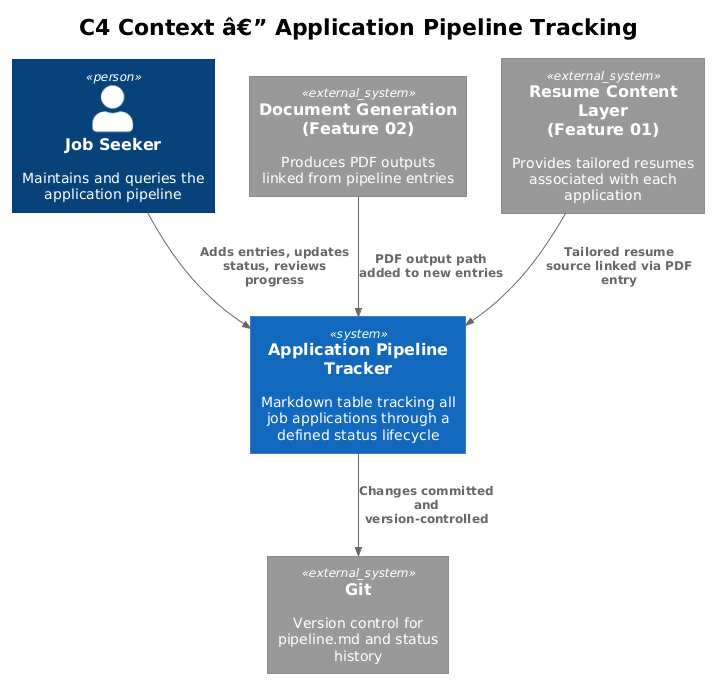
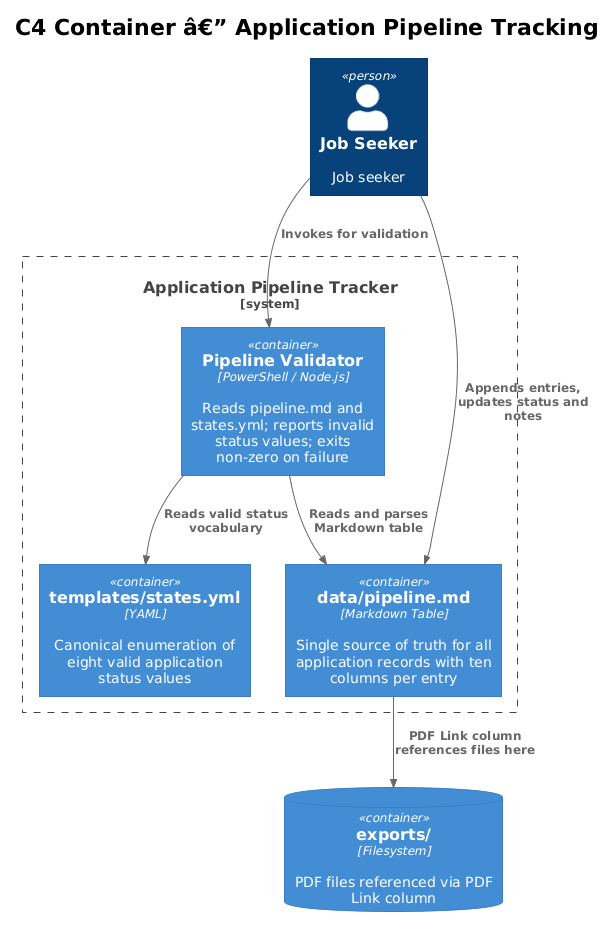
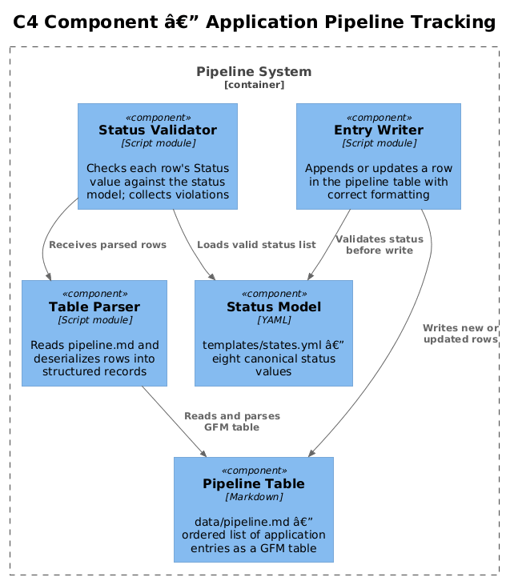
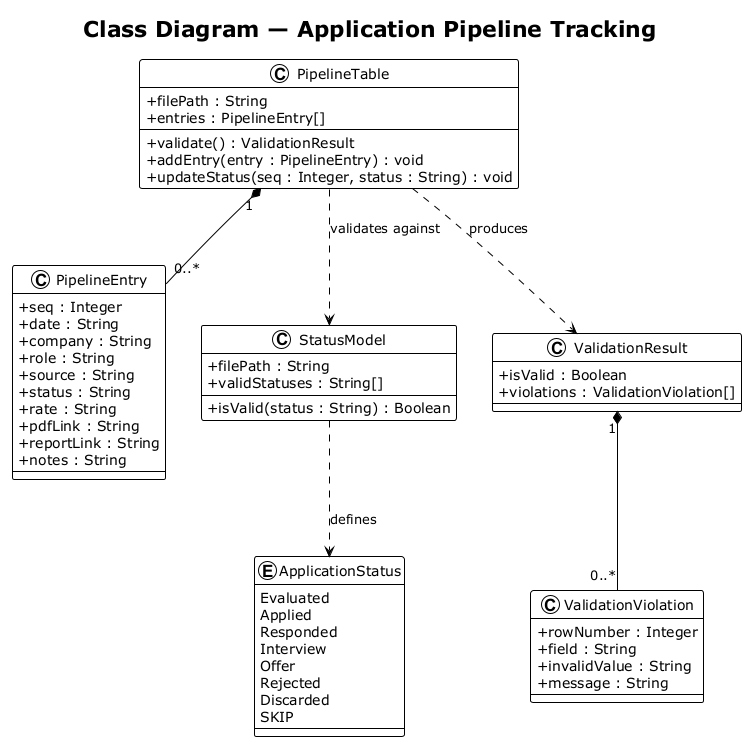
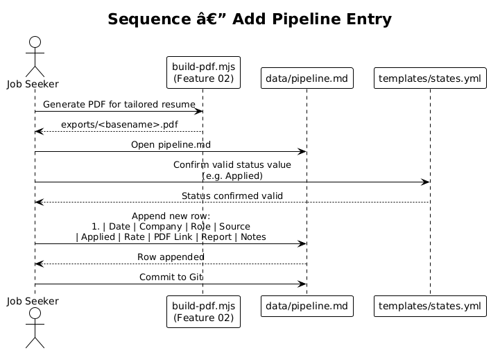
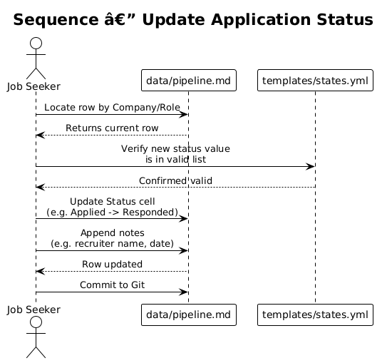
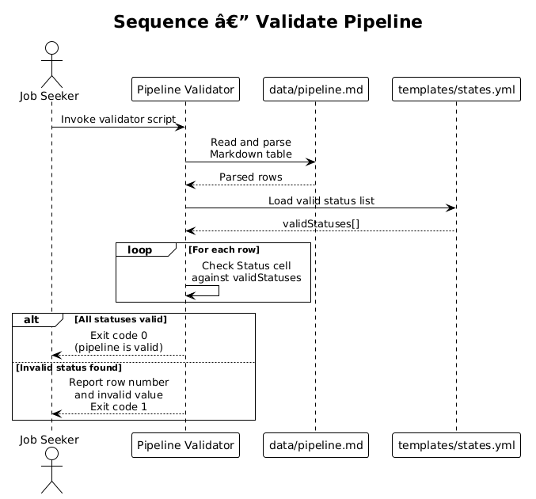

# Feature 03 — Application Pipeline Tracking — Detailed Design

## 1. Overview

This feature provides a structured, file-based mechanism for tracking every role applied to through a defined lifecycle of states. The pipeline is maintained as a single Markdown table in `data/pipeline.md`. Each entry links to the originating tailored resume PDF, the application date, compensation details, current status, and optionally to a company research report. Status values are governed by a canonical YAML file to prevent invalid entries.

**Scope of this feature:**
- `data/pipeline.md` — the single Markdown table tracking all applications
- `templates/states.yml` — canonical status enumeration
- Workflow for adding entries, updating status, and validating the pipeline

**Requirements satisfied:**
- L1-003: Track every role through a defined lifecycle with full traceability
- L2-007: `data/pipeline.md` table with columns: `#`, `Date`, `Company`, `Role`, `Source`, `Status`, `Rate`, `PDF Link`, `Report Link`, `Notes`
- L2-008: Valid status values defined in `templates/states.yml`; no other values permitted

---

## 2. Architecture

### 2.1 C4 Context Diagram



The Application Pipeline tracking system interacts with the job seeker directly, with the Document Generation feature (which produces the PDFs linked from pipeline entries), and with the Resume Content Management feature (which produces the tailored Markdown sources). Git provides version control for the pipeline file.

### 2.2 C4 Container Diagram



The pipeline system consists of two data containers: `data/pipeline.md` (the tracking table) and `templates/states.yml` (the status vocabulary). Supporting automation may validate the pipeline file against the canonical status list. The Document Generation feature feeds PDF links into new pipeline entries.

### 2.3 C4 Component Diagram



The three key components within the pipeline system are the pipeline table itself, the status model, and the pipeline validator. The validator reads the table and checks each status cell against the canonical status list.

---

## 3. Component Details

### 3.1 `data/pipeline.md` (Application Pipeline Table)

A Markdown table updated after every tailored resume build. Each row represents one application.

**Columns:**

| Column | Description |
|---|---|
| `#` | Auto-incrementing sequence number |
| `Date` | Date the application was submitted (ISO format: `YYYY-MM-DD`) |
| `Company` | Company name |
| `Role` | Job title |
| `Source` | Where the role was found (e.g., LinkedIn, Referral, Indeed) |
| `Status` | Current lifecycle status — must be a value from `templates/states.yml` |
| `Rate` | Compensation figure (hourly rate or annual salary) |
| `PDF Link` | Relative path or filename of the submitted PDF in `exports/` |
| `Report Link` | Optional relative path to a company research report |
| `Notes` | Free-text annotations (interview dates, contact names, next steps) |

### 3.2 `templates/states.yml` (Canonical Status Model)

Defines the exhaustive set of permitted status values. No value outside this list may appear in the `Status` column of `data/pipeline.md`.

**Valid statuses:**

| Status | Meaning |
|---|---|
| `Evaluated` | Role reviewed and deemed worth pursuing |
| `Applied` | Application submitted |
| `Responded` | Recruiter or hiring manager has responded |
| `Interview` | Interview scheduled or completed |
| `Offer` | Offer received |
| `Rejected` | Application rejected |
| `Discarded` | Decided not to pursue after initial evaluation |
| `SKIP` | Role noted but intentionally skipped without evaluation |

### 3.3 Pipeline Validator

**Script:** `scripts/Validate-Pipeline.ps1`

Reads `data/pipeline.md`, parses the table, extracts every `Status` cell value, and validates each against the list in `templates/states.yml`. Reports invalid values and exits with a non-zero code. Intended to run after manual edits or as a pre-commit hook.

Also validates:
- `Date` column values match `YYYY-MM-DD` format
- `#` column values are unique and monotonically increasing
- Status values that contain Markdown formatting or embedded dates (L2-008 AC3)
- No blank values in required columns (`Date`, `Company`, `Role`, `Source`, `Status`)

---

## 4. Data Model

### 4.1 Class Diagram



### 4.2 Entity Descriptions

**PipelineTable**
Represents the entire `data/pipeline.md` file. Contains an ordered list of `PipelineEntry` instances. Has a `validate()` method that checks all entries against the `StatusModel`.

**PipelineEntry**
Represents a single row in the pipeline table. Contains all column values. Has a `status` property constrained to values in `StatusModel`. The `pdfLink` and `reportLink` are relative paths.

**StatusModel**
Loaded from `templates/states.yml`. Provides the authoritative list of valid status strings. Has an `isValid(status)` method used by the validator.

**ApplicationStatus** (enumeration)
The eight valid status values: `Evaluated`, `Applied`, `Responded`, `Interview`, `Offer`, `Rejected`, `Discarded`, `SKIP`.

---

## 5. Key Workflows

### 5.1 Add Pipeline Entry



After building a tailored resume PDF (Feature 02), the job seeker opens `data/pipeline.md`, appends a new row with the next sequence number, populates all columns including the relative path to the generated PDF, and commits the change to Git. Initial status is typically `Applied` or `Evaluated`.

### 5.2 Update Application Status



When the application status changes (e.g., a recruiter responds), the job seeker locates the relevant row in `data/pipeline.md`, updates the `Status` cell to a valid value from `templates/states.yml`, updates the `Notes` column as appropriate, and commits the change.

### 5.3 Validate Pipeline



The pipeline validator reads `data/pipeline.md` and `templates/states.yml`, parses both, and checks every status value in the table. Valid entries pass silently. Invalid entries are reported with the row number and offending value. The process exits with code `1` if any invalid status is found.

---

## 6. API Contracts

### `scripts/Validate-Pipeline.ps1`

```
.\scripts\Validate-Pipeline.ps1
```

No parameters. Always reads `data/pipeline.md` and `templates/states.yml` from the repository root.

Exit codes: `0` = all entries valid, `1` = one or more validation failures.

Output on failure: one line per invalid row, format: `Row <#>: <field> — <reason>`.

---

Automation scripts operating on the pipeline must respect the following implicit contracts:

- **Status constraint:** The `Status` column value must exactly match one of the eight values in `templates/states.yml` (case-sensitive).
- **Date format:** The `Date` column must use ISO 8601 format: `YYYY-MM-DD`.
- **PDF Link format:** Must be a relative path resolvable from the repository root, pointing to a file in `exports/`.
- **Sequence number:** The `#` column must be unique and monotonically increasing.
- **Table structure:** The pipeline file must be a valid GitHub Flavored Markdown table with exactly ten columns in the order specified in L2-007.

---

## 7. Security Considerations

- `data/pipeline.md` may contain salary/rate expectations, recruiter names, and notes about compensation offers. Ensure the Git repository is **private**.
- The `Rate` column should not contain sensitive negotiation strategy notes — use the `Notes` column cautiously.
- If the pipeline file is ever shared externally (e.g., printed or exported), review the `Notes` column for personal or confidential content before sharing.
- `templates/states.yml` contains no sensitive data and is safe to commit to any repository.

---

## 8. Open Questions

| # | Question | Status |
|---|---|---|
| 1 | Should the pipeline validator run as a Git pre-commit hook automatically? | Open |
| 2 | Should the `PDF Link` column reference absolute paths, relative paths, or just filenames? | Open |
| 3 | Should a summary view (e.g., count by status) be auto-generated from the pipeline table? | Open |
| 4 | Should `data/pipeline.md` be split by year once entries exceed a threshold? | Open |
| 5 | Should the `Report Link` column reference files in a dedicated `data/reports/` directory? | Open |
