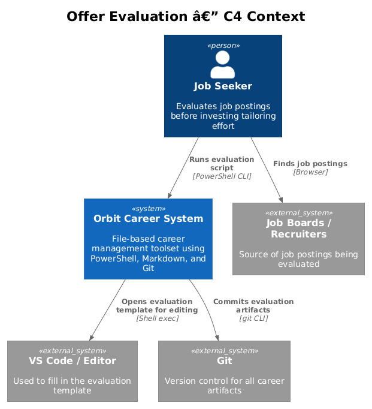
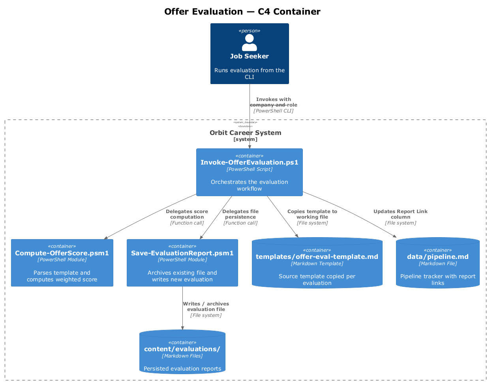
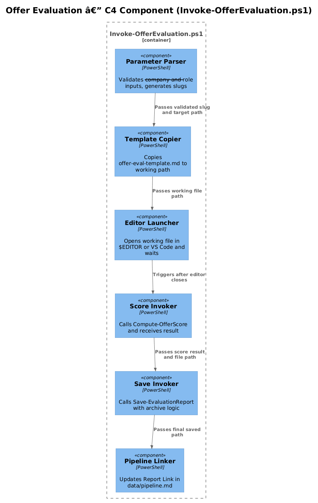
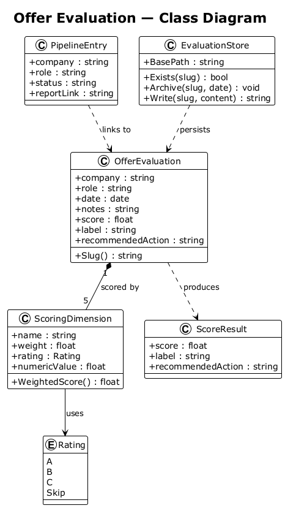
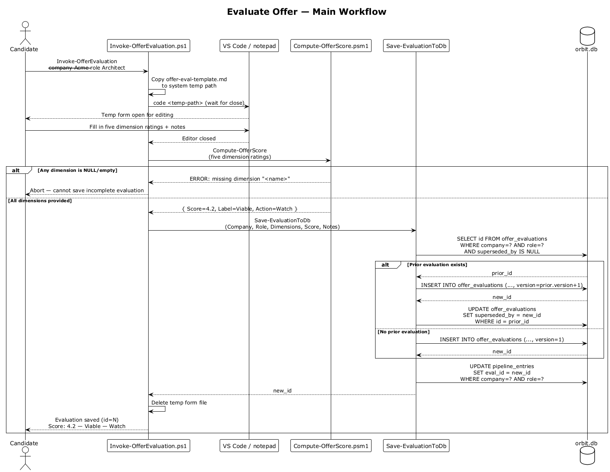
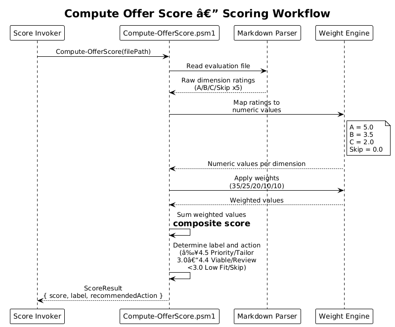
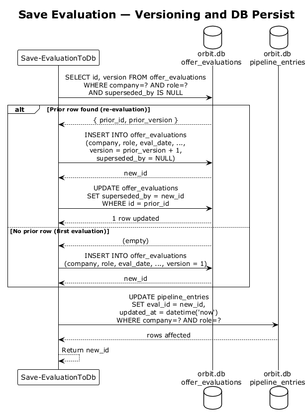

# Feature 04 — Offer Evaluation — Detailed Design

## 1. Overview

Feature 04 provides a structured, scored evaluation framework for job postings within Orbit. Before any tailoring effort is invested, each opportunity is assessed against a defined set of weighted dimensions and assigned a numeric score. Evaluation artifacts are stored per role in a consistent Markdown format and linked from the central pipeline tracker.

**Scope:**
- L1-004: Structured evaluation of job postings with weighted scoring
- L2-009: Offer evaluation template with per-dimension scoring fields
- L2-010: Weighted numeric scoring (1.0–5.0) with recommended action thresholds
- L2-025: Evaluation report storage with versioning via date-suffixed renames

**Key design decisions:**
- Evaluations are plain Markdown files — no database or server required
- Scoring is deterministic and reproducible from the template fields
- Archiving via rename (not delete) preserves audit history
- Pipeline integration is a link column update only — no pipeline logic is embedded in the evaluator

---

## 2. Architecture

### 2.1 C4 Context Diagram



### 2.2 C4 Container Diagram



### 2.3 C4 Component Diagram



---

## 3. Component Details

### 3.1 Offer Evaluator (PowerShell script)

**Script:** `scripts/Invoke-OfferEvaluation.ps1`

Responsibilities:
- Accept `--company` and `--role` parameters
- Copy `templates/offer-eval-template.md` to the target path
- Open the file for editing via VS Code (`code <path>`); falls back to `notepad.exe` if `code` is not on PATH
- After editing, invoke the score computation module
- Call the save/archive module to persist the result
- Update the pipeline tracker with the report link

**Parameters:**

| Parameter | Required | Description |
|-----------|----------|-------------|
| `--company` | Yes | Company name (used in slug) |
| `--role` | Yes | Role title (used in slug) |
| `--force` | No | Overwrite without archiving the old file |

### 3.2 Score Computer (PowerShell module)

**Module:** `scripts/modules/Compute-OfferScore.psm1`

Responsibilities:
- Parse the completed evaluation Markdown for five scoring fields
- Map raw ratings to numeric scores
- Apply dimension weights
- Return composite score, label, and recommended action

**Weight table:**

| Dimension | Weight |
|-----------|--------|
| Technical Match | 35% |
| Seniority Alignment | 25% |
| Archetype Fit | 20% |
| Compensation Fairness | 10% |
| Market Demand | 10% |

**Score thresholds:**

| Score | Label | Recommended Action |
|-------|-------|--------------------|
| ≥ 4.5 | Priority | Tailor |
| 3.0–4.4 | Viable | Watch |
| < 3.0 | Low Fit | Skip |

> **Note:** `Watch` replaces `Review` to align with L2-009 AC2. `Tailor`, `Watch`, and `Skip` are the only three permitted recommended-action values.

**Missing dimension handling (L2-010 AC4):** If any of the five weighted dimensions has no rating in the evaluation file (field absent or empty), `Compute-OfferScore` must exit with a non-zero code and print an error identifying the missing dimension by name. It must not default missing dimensions to 0 or Skip silently.

### 3.3 Evaluation Template

**File:** `templates/offer-eval-template.md`

Contains YAML front-matter placeholders for all scored dimensions plus free-text notes fields. Each dimension supports A/B/C/Skip ratings. The template is never modified — it is copied on each evaluation run.

**Evaluated dimensions:**
1. Role fit vs. candidate profile
2. Rate vs. target rate
3. Remote/hybrid terms
4. Domain alignment
5. Company stability
6. Contract length
7. Interview likelihood
8. Growth potential

The five weighted dimensions (Technical Match, Seniority Alignment, Archetype Fit, Compensation Fairness, Market Demand) map to a subset of the above and drive the numeric score.

### 3.4 Evaluation Store

**Directory:** `content/evaluations/`

Naming convention: `<company-slug>-<role-slug>-eval.md`

Archiving convention: if a file already exists at the target path, it is renamed to `<company-slug>-<role-slug>-eval-<YYYYMMDD>.md` before the new file is written.

### 3.5 Pipeline Linker

**Responsibility:** Update the pipeline tracker

Finds the row matching company + role and writes the relative path to the evaluation file in the report link column. Uses a simple regex-based line replacement — no Markdown parser dependency.

---

## 4. Data Model

### 4.1 Class Diagram



### 4.2 Entity Descriptions

#### OfferEvaluation

Represents a completed evaluation artifact. Persisted as a Markdown file with YAML front-matter.

| Field | Type | Description |
|-------|------|-------------|
| `company` | string | Company name |
| `role` | string | Role title |
| `date` | date | Evaluation date |
| `technicalMatch` | Rating | A / B / C / Skip |
| `seniorityAlignment` | Rating | A / B / C / Skip |
| `archetypeFit` | Rating | A / B / C / Skip |
| `compensationFairness` | Rating | A / B / C / Skip |
| `marketDemand` | Rating | A / B / C / Skip |
| `notes` | string | Free-text notes per dimension |
| `score` | number | Computed composite score 0.0–5.0 (0.0 only when all five dimensions are rated `Skip`) |
| `label` | string | Priority / Viable / Low Fit |
| `recommendedAction` | string | Tailor / Review / Skip |

#### ScoringDimension

| Field | Type | Description |
|-------|------|-------------|
| `name` | string | Dimension label |
| `weight` | number | Decimal weight (e.g. 0.35) |
| `rating` | Rating | Raw rating from template |
| `numericValue` | number | Mapped numeric value |

#### PipelineEntry

Represents a row in the pipeline tracker.

| Field | Type | Description |
|-------|------|-------------|
| `company` | string | Company name |
| `role` | string | Role title |
| `status` | string | Pipeline stage |
| `reportLink` | string | Relative path to evaluation file |

---

## 5. Key Workflows

### 5.1 Evaluate Offer



The user invokes `Invoke-OfferEvaluation.ps1` with `--company` and `--role`. The script copies the template, opens it for editing, computes the score after the user saves, then delegates to save and pipeline-link steps.

### 5.2 Compute Score



The Score Computer parses the five weighted dimension fields from the completed Markdown, maps each A/B/C/Skip to a numeric value, applies weights, sums the result, and returns a score with label and recommended action.

### 5.3 Save Evaluation



Before writing the new evaluation file, the save module checks whether a file already exists at the target path. If it does, the existing file is renamed with a date suffix. The new file is then written and the pipeline entry is updated with the report link.

---

## 6. API Contracts

No external API. All interactions are file-system operations and PowerShell function calls.

**PowerShell function signatures:**

```powershell
# Main entry point
function Invoke-OfferEvaluation {
    param (
        [Parameter(Mandatory)] [string] $Company,
        [Parameter(Mandatory)] [string] $Role,
        [switch] $Force
    )
}

# Score computation
function Compute-OfferScore {
    param (
        [Parameter(Mandatory)] [string] $EvalFilePath
    )
    # Returns: [PSCustomObject] @{ Score; Label; RecommendedAction }
    # Throws: if any of the five weighted dimensions is absent or empty in $EvalFilePath
}

# Archive and save
function Save-EvaluationReport {
    param (
        [Parameter(Mandatory)] [string] $SourcePath,
        [Parameter(Mandatory)] [string] $Company,
        [Parameter(Mandatory)] [string] $Role,
        [switch] $Force
    )
    # Returns: [string] final saved path
}

# Pipeline link update
function Update-PipelineLink {
    param (
        [Parameter(Mandatory)] [string] $Company,
        [Parameter(Mandatory)] [string] $Role,
        [Parameter(Mandatory)] [string] $ReportPath
    )
}
```

**Rating-to-numeric mapping:**

| Rating | Numeric Value |
|--------|---------------|
| A      | 5.0           |
| B      | 3.5           |
| C      | 2.0           |
| Skip   | 0.0           |

---

## 7. Security Considerations

- No secrets or credentials are processed by this feature
- Evaluation files may contain salary/rate expectations — the `content/evaluations/` directory should be excluded from any public repository remotes
- The `.gitignore` should include a note that `content/evaluations/` is sensitive; the decision to commit evaluations is left to the user
- The rename/archive strategy ensures no evaluation data is silently lost during overwrites

---

## 8. Open Questions

| # | Question | Status |
|---|----------|--------|
| 1 | Should the Score Computer support custom weight overrides via `config/profile.yml`? | Open |
| 2 | Should `Skip`-rated dimensions be excluded from the weighted average rather than scoring 0? | **Resolved: No.** A `Skip` rating is a deliberate user choice meaning "I am not evaluating this" and should be treated as 0 contribution to the score. This is distinct from a *missing* dimension (absent front-matter field), which is an error per L2-010 AC4. |
| 3 | Should pipeline tracker updates use a dedicated PowerShell module or inline logic? | **Resolved: Dedicated module** (`Update-PipelineLink` as designed in Section 3.5) to keep `Invoke-OfferEvaluation.ps1` focused and testable. |
| 4 | Should archived evaluations be listed in the pipeline with an `[Archived]` tag? | Open |
