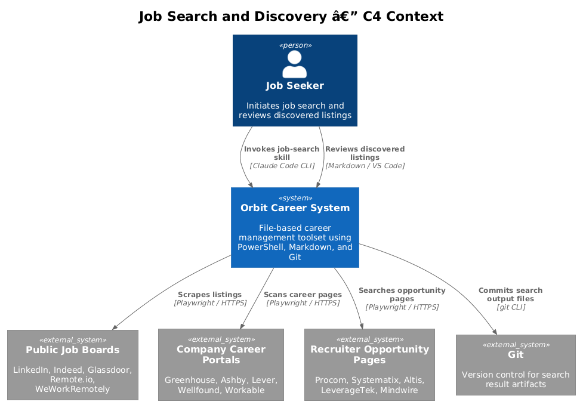
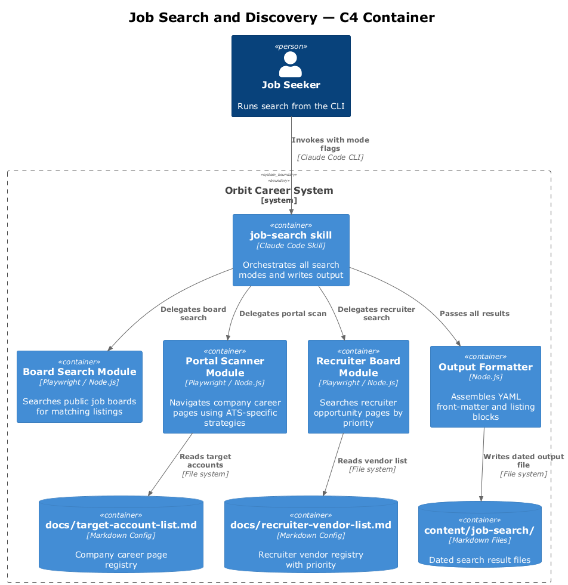
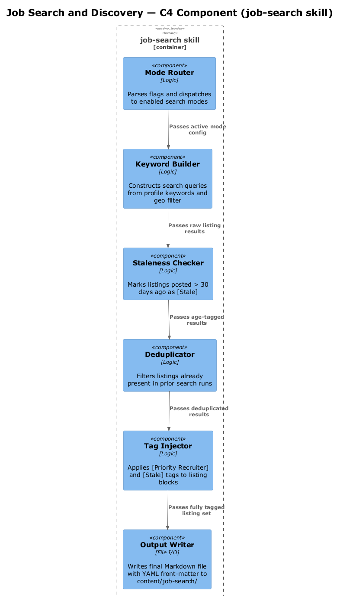
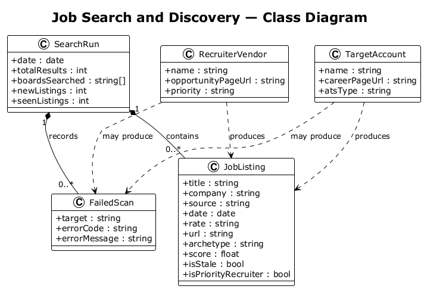
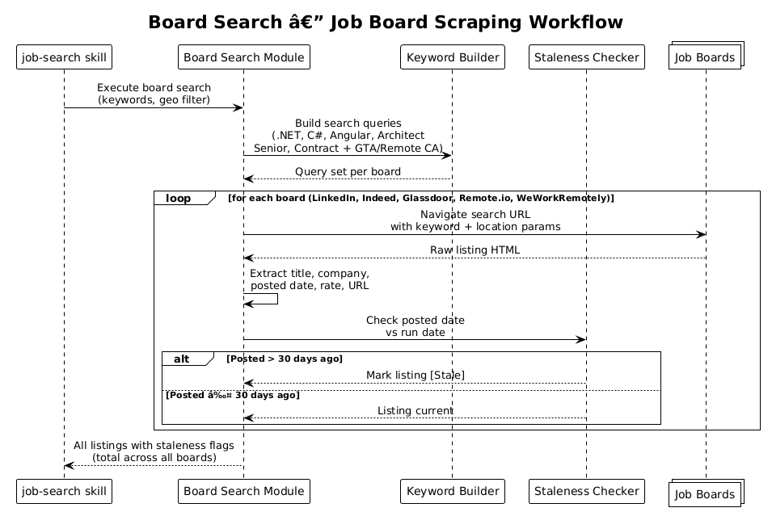
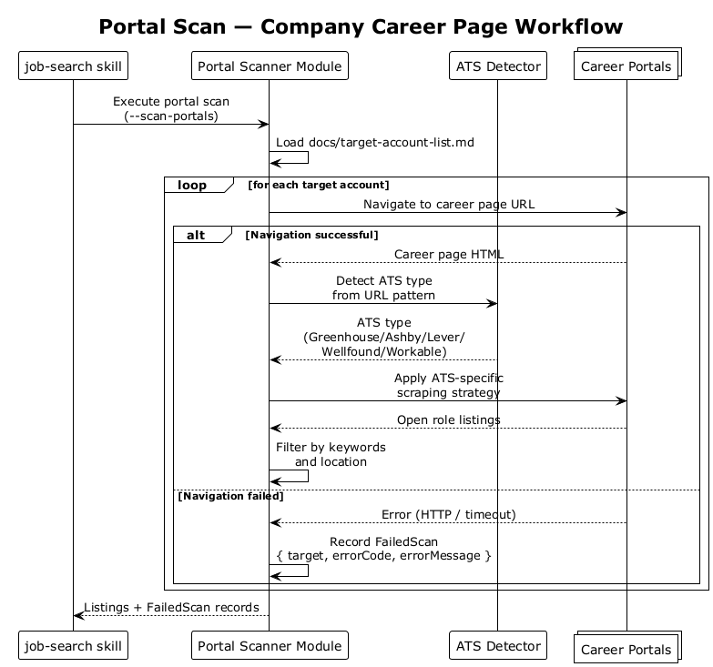
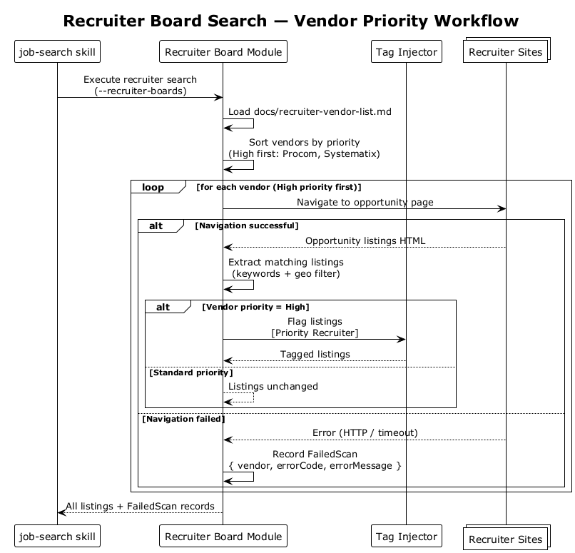

# Feature 05 — Job Search and Discovery — Detailed Design

## 1. Overview

Feature 05 automates the discovery of relevant job and contract opportunities within Orbit by searching public job boards, company career portals, and recruiter-specific boards. Results are persisted directly to the Orbit SQLite database (`data/orbit.db`) via the `job_listings` and `scan_runs` tables, then exported to a human-readable Markdown file. The database is the source of truth; the Markdown export is derived output.

**Scope:**
- L1-005: Automated job discovery matching the candidate profile
- L2-011: Job board search across major general-purpose and remote-specific boards
- L2-012: Company portal scanner for accounts in the target account list
- L2-013: Recruiter board search for vendors in the recruiter vendor list
- L2-026: Standardized YAML front-matter + listing block output format

**Key design decisions:**
- Three distinct modes (`--board-search`, `--scan-portals`, `--recruiter-boards`) can be run independently or together
- All results are persisted to `job_listings` and `scan_runs` tables via Feature 06's HistoryStore; the search module delegates all DB writes to Feature 06
- Staleness (`is_stale = 1`) is set during upsert (posted_date > 30 days before run_date)
- Priority recruiter results are flagged `is_priority_recruiter = 1` on the `job_listings` row
- Target accounts are read from `target_accounts` DB table; recruiter vendors from `recruiter_contacts`
- Target keywords and geographic filters are driven by `config/profile.yml`

---

## 2. Architecture

### 2.1 C4 Context Diagram



### 2.2 C4 Container Diagram



### 2.3 C4 Component Diagram



---

## 3. Component Details

### 3.1 Job Search Orchestrator

**Responsibility:** Primary orchestrator for all search modes.

Accepts mode flags, reads the candidate profile for keywords and location preferences, delegates to three sub-components, merges results, applies deduplication, and writes the output file.

**Invocation modes:**

| Flag | Description |
|------|-------------|
| `--board-search` | Search public job boards |
| `--scan-portals` | Scan company career portals |
| `--recruiter-boards` | Search recruiter opportunity pages |
| *(no flag)* | Run all three modes |

**Profile inputs:** Target keywords and geographic filters are read at runtime from `config/profile.yml`. The orchestrator must not use hardcoded keyword or location values.

**`config/profile.yml` schema:**

```yaml
candidate:
  name: string                  # Full name
  base_resume: string           # Filename of the primary base resume (e.g. focused-base.md)

search:
  keywords:                     # One or more search terms; each is searched independently
    - string
  location:                     # Human-readable location string passed to board search URLs
    primary: string             # e.g. "Ottawa, ON"
    fallback: string            # e.g. "Remote" — used when primary returns < 5 results
  exclude_companies:            # Companies to suppress from all results
    - string

compensation:
  target_rate_hourly: number    # Candidate's target hourly rate (used in offer evaluation)
  target_salary_annual: number  # Candidate's target annual salary

archetype_preferences:          # Optional per-archetype weight overrides for offer scoring
  enterprise_contract:
    technical_match_weight: number   # default 0.35
```

This file contains personal data and **must be excluded from version control** (add to `.gitignore`).

**Session integrity check (L2-023):** Before executing any search or evaluation, the orchestrator validates:
1. `content/base/<profile.candidate.base_resume>` exists — error and exit if missing
2. The base resume was last modified within 90 days — warn and prompt to confirm if stale
3. Profile data is read live from `config/profile.yml` at startup — no cached or hardcoded profile summary is used

```powershell
function Assert-SessionIntegrity {
    param (
        [Parameter(Mandatory)] [string] $ProfilePath,
        [Parameter(Mandatory)] [string] $BaseResumePath
    )
    # Exits with code 1 if base resume missing
    # Prompts to confirm if base resume > 90 days old
    # Returns: [void] on success
}
```

### 3.2 Board Search Module

**Responsibility:** Search general-purpose and remote-specific job boards

For each board:
1. Construct search URL from keyword and location parameters sourced from the candidate profile
2. Navigate and extract listing elements
3. Parse title, company, posted date, rate, and URL
4. Mark listings older than 30 days as `[Stale]`
5. **Per-keyword zero-match warning (L2-011 AC3):** For each configured keyword, if the board returns zero results for that keyword, emit a warning in the output file's "Warnings" section: `No results for keyword "<keyword>" on <Board>`. This is distinct from a FailedScan — the board was reachable, it simply returned no matches.

**Supported board categories:**

| Category | Examples |
|----------|----------|
| General-purpose boards | LinkedIn, Indeed, Glassdoor |
| Remote-specific boards | Remote.io, WeWorkRemotely |

### 3.3 Portal Scanner Module

**Responsibility:** Navigate to career pages of accounts in the `target_accounts` DB table

For each company:
1. Resolve the career page URL from the account list
2. Detect ATS type (Greenhouse, Ashby, Lever, Wellfound, Workable)
3. Apply ATS-specific scraping strategy
4. Extract matching open roles

**Supported ATS platforms:**

| ATS | Detection Method |
|-----|-----------------|
| Greenhouse | `boards.greenhouse.io` URL pattern |
| Ashby | `jobs.ashbyhq.com` URL pattern |
| Lever | `jobs.lever.co` URL pattern |
| Wellfound | `wellfound.com/company/*/jobs` pattern |
| Workable | `apply.workable.com` URL pattern |

Failed scans are collected and listed in the "Failed to scan" section of the output file with an error code.

**No portal configured (L2-012 AC4):** Companies in `target_accounts` with a NULL `career_page_url` are listed in a separate "No portal configured" section in the export — distinct from "Failed to scan". This makes it clear the omission is a data gap, not a scan failure.

### 3.4 Recruiter Board Module

**Responsibility:** Search opportunity pages of staffing vendors in the `recruiter_contacts` DB table (`priority_tier = 'High'` searched first)

Execution order: `Priority: High` vendors are searched first. Results from priority vendors are flagged `[Priority Recruiter]` in the listing block. Failed vendor scans are listed in the "Failed to scan" section.

### 3.5 Output Formatter

**Responsibility:** Assemble the final Markdown output file

- Writes YAML front-matter with run metadata
- Groups listings by source
- Injects `[Stale]`, `[Priority Recruiter]` tags
- Appends "Warnings" section for per-keyword zero-match warnings
- Appends "No portal configured" section for companies missing a career page URL
- Appends "Failed to scan" section for scan errors (non-200, navigation failures)
- Writes file to `data/search-results/<YYYY-MM-DD>.md`

---

## 4. Data Model

### 4.1 Class Diagram



### 4.2 Entity Descriptions

#### SearchRun

Represents a single execution of the job search module. Persisted as the YAML front-matter of the output file.

| Field | Type | Description |
|-------|------|-------------|
| `date` | date | Run date |
| `totalResults` | int | Total listings found |
| `boardsSearched` | string[] | List of boards/portals scanned |
| `newListings` | int | Listings not seen in prior runs |
| `seenListings` | int | Listings already in scan history |

#### JobListing

Represents a single discovered opportunity.

| Field | Type | Description |
|-------|------|-------------|
| `title` | string | Job title |
| `company` | string | Company name |
| `source` | string | Board, portal, or recruiter name |
| `date` | date | Posted date |
| `rate` | string | Rate or "Rate not listed" |
| `url` | string | Direct link to listing |
| `archetype` | string | Classified role archetype |
| `score` | number | Auto-scored fit estimate |
| `isStale` | bool | Posted > 30 days ago |
| `isPriorityRecruiter` | bool | From a Priority: High vendor |

#### TargetAccount

Represents a company in `docs/target-account-list.md`.

| Field | Type | Description |
|-------|------|-------------|
| `name` | string | Company name |
| `careerPageUrl` | string | URL of careers page |
| `atsType` | string | Detected ATS platform |

#### RecruiterVendor

Represents a staffing vendor in `docs/recruiter-vendor-list.md`.

| Field | Type | Description |
|-------|------|-------------|
| `name` | string | Vendor name |
| `opportunityPageUrl` | string | URL of job listings page |
| `priority` | string | High / Standard |

#### FailedScan

Represents a scan that could not be completed.

| Field | Type | Description |
|-------|------|-------------|
| `target` | string | Company or vendor name |
| `errorCode` | string | HTTP or parse error code |
| `errorMessage` | string | Human-readable error detail |

---

## 5. Key Workflows

### 5.1 Board Search



The orchestrator iterates over each configured job board, constructs a keyword + location search from the candidate profile, and extracts listings. Staleness is evaluated during extraction. All results are passed to the output formatter.

### 5.2 Portal Scan



The orchestrator loads the target account list, navigates to each career page, detects the ATS type, and applies the appropriate scraping strategy. Any navigation or parse failure is captured as a FailedScan record.

### 5.3 Recruiter Board Search



The orchestrator loads the recruiter vendor list, sorts by priority (High first), and searches each vendor's opportunity page. Priority vendor results are tagged `[Priority Recruiter]`. Failed vendors are captured as FailedScan records.

---

## 6. API Contracts

No external REST API. All interactions are browser automation (Playwright) and file-system writes.

**Output file location:** `data/search-results/<YYYY-MM-DD>.md`

**YAML front-matter schema:**

```yaml
---
date: 2026-04-05
total_results: 42
boards_searched:
  - LinkedIn
  - Indeed
  - Glassdoor
  - Remote.io
  - WeWorkRemotely
new_listings: 38
seen_listings: 4
---
```

**Listing block schema:**

```markdown
### Senior Software Architect — Acme Corp

- **title**: Senior Software Architect
- **company**: Acme Corp
- **source**: LinkedIn
- **date**: 2026-03-28
- **rate**: $120/hr
- **url**: https://linkedin.com/jobs/view/...
- **archetype**: Enterprise Contract
- **score**: 4.2
```

**Tags appended inline to the listing heading when applicable:**

| Tag | Condition |
|-----|-----------|
| `[Stale]` | Posted date > 30 days before run date |
| `[Priority Recruiter]` | Source is a Priority: High vendor |

---

## 7. Security Considerations

- No credentials are stored by this feature; all sites are accessed as a guest browser session
- Job boards may rate-limit or block automated access — the module should respect `robots.txt` and implement polite delays between requests
- The output files in `data/search-results/` may contain personally sensitive rate/negotiation context and should be excluded from public repository remotes
- URLs in listing blocks should be treated as untrusted input and not executed programmatically

---

## 8. Open Questions

| # | Question | Status |
|---|----------|--------|
| 1 | Should deduplication across runs be based on URL hash or title+company composite key? | Open |
| 2 | Should the `score` field in listing blocks be computed by the search module or deferred to the offer evaluator? | Open |
| 3 | Should failed portal scans trigger a retry with exponential backoff, or fail immediately? | Open |
| 4 | Should `docs/target-account-list.md` and `docs/recruiter-vendor-list.md` have a defined schema enforced by a validator script? | Open |
| 5 | Should the search output file be automatically staged to the pipeline tracker or remain a separate artifact? | Open |
