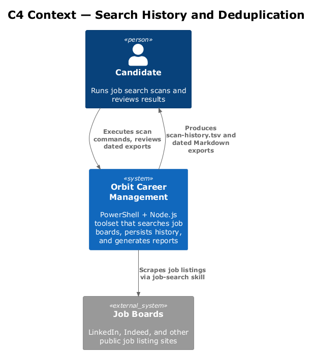
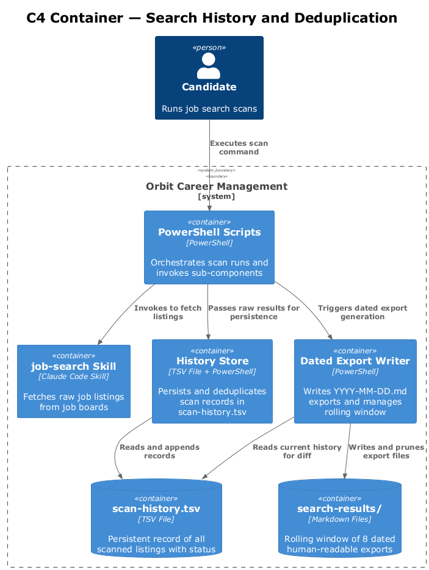
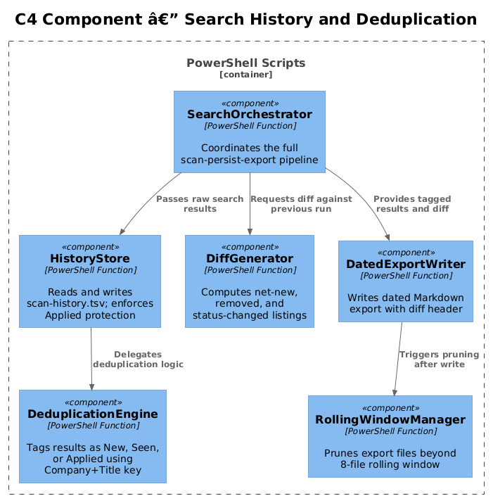
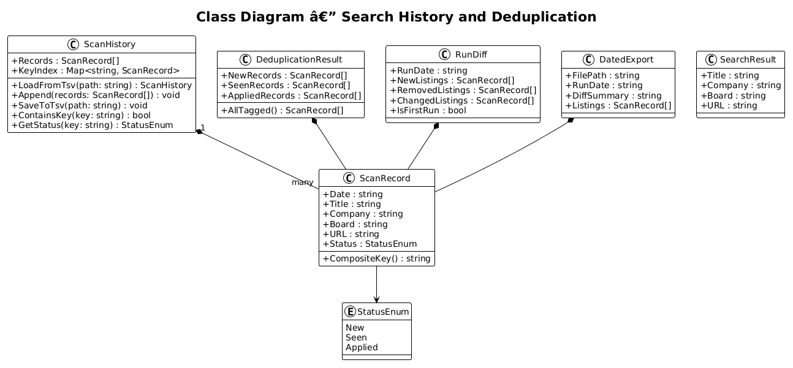
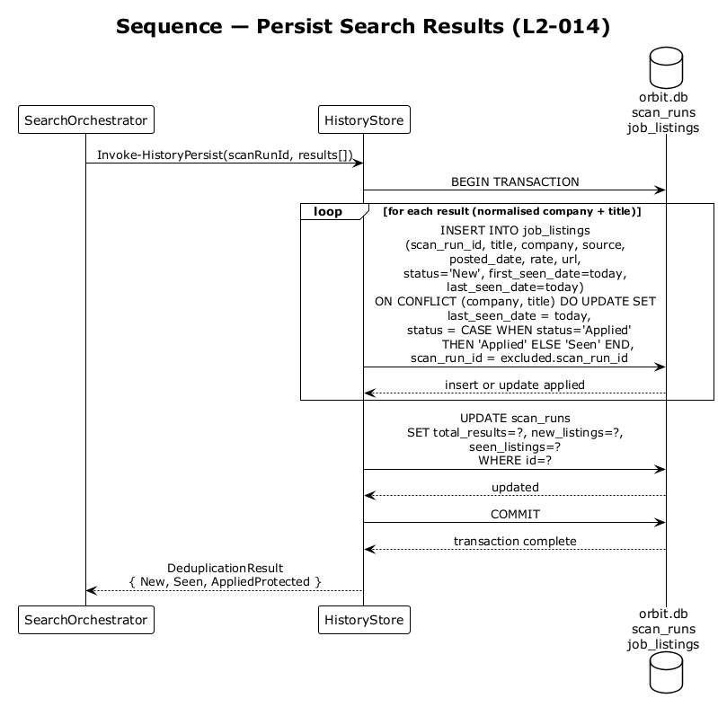
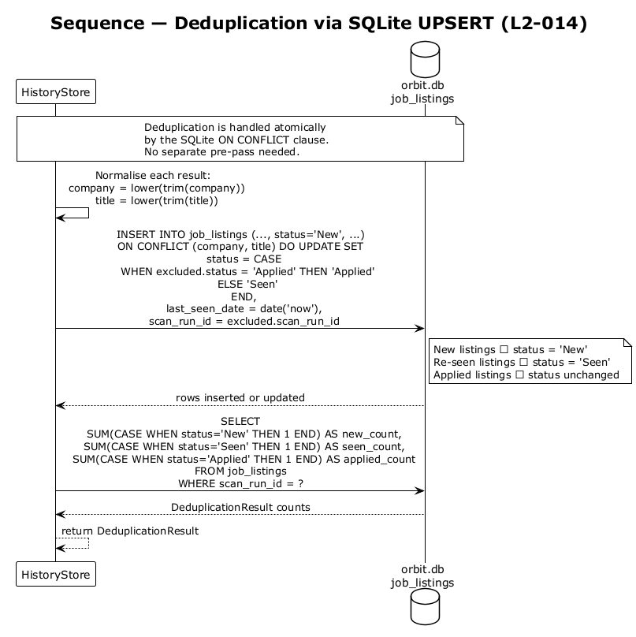
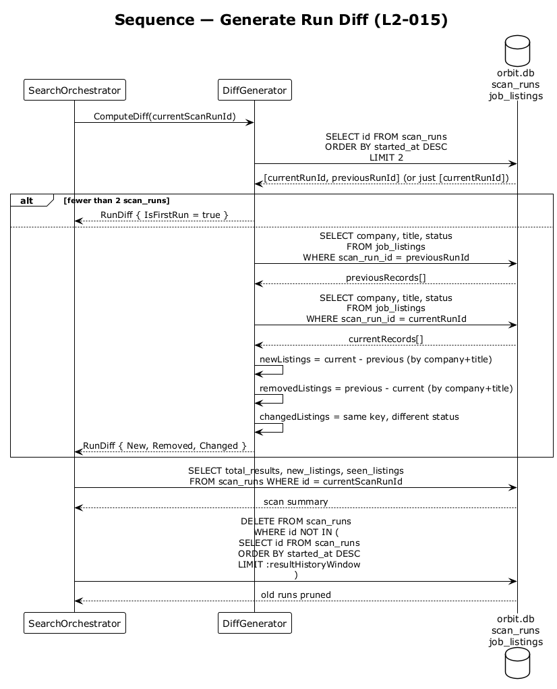

# Feature 06 — Search History and Deduplication — Detailed Design

## 1. Overview

Feature 06 provides persistent job search history with intelligent deduplication within Orbit. After each job search run, the full result set is appended to a TSV history file. Listings are deduplicated by Company + Title across runs, and a human-readable dated export captures net-new, removed, and status-changed listings relative to the previous run.

**Stories covered:**
- **L2-014** — Search Result Persistence: append to `data/scan-history.tsv` with deduplication logic
- **L2-015** — Dated Search Result Export: write `data/search-results/YYYY-MM-DD.md` with diff summary; retain 8 most recent files

**Design constraints:**
- No database server; TSV file is the persistence layer
- User-set `Applied` status must never be overwritten by a scan
- Rolling window of 8 dated export files; oldest deleted on overflow
- First run produces a "no prior results" note rather than a diff

---

## 2. Architecture

### 2.1 C4 Context Diagram



### 2.2 C4 Container Diagram



### 2.3 C4 Component Diagram



---

## 3. Component Details

### 3.1 HistoryStore
Manages all read/write operations against `data/scan-history.tsv`. Responsible for creating the file on first run, appending new records, and enforcing the status-protection rule (never overwrite `Applied`).

### 3.2 DeduplicationEngine
Compares an incoming result set against existing history records. Uses a normalised `Company + Title` key. Returns three buckets: `New`, `Seen`, and `Applied` (pass-through).

### 3.3 DiffGenerator
Loads the two most recent dated export files (or signals first-run) and computes:
- Net-new listings (present in current, absent in previous)
- Removed listings (present in previous, absent in current)
- Status-changed listings (same key, different status)

### 3.4 DatedExportWriter
Serialises the current result set with its diff summary to `data/search-results/YYYY-MM-DD.md`. After writing, prunes any files beyond the 8-file rolling window.

### 3.5 RollingWindowManager
Enumerates files matching `data/search-results/*.md`, sorts by name (ISO date), and deletes the oldest when count exceeds 8.

---

## 4. Data Model

### 4.1 Class Diagram



### 4.2 TSV Schema

`data/scan-history.tsv` header row (tab-separated, created on first run):

```
Date\tTitle\tCompany\tBoard\tURL\tStatus
```

| Column | Type | Description |
|--------|------|-------------|
| `Date` | `YYYY-MM-DD` | Date the listing was first seen |
| `Title` | string | Job title (normalized: lowercase, trimmed) |
| `Company` | string | Company name (normalized: lowercase, trimmed) |
| `Board` | string | Source board, portal, or recruiter name |
| `URL` | string | Direct URL to the listing |
| `Status` | `New` \| `Seen` \| `Applied` | Deduplication status; `Applied` is user-set and write-protected |

The composite deduplication key is `Company + Title` (both normalized). `URL` and `Board` are not part of the key — a listing that moves boards is treated as a `Seen` match if the key exists (open question Q3/Q4).

### 4.3 Entity Descriptions

| Entity | Description |
|---|---|
| `ScanRecord` | One row in `scan-history.tsv`. Fields: `Date`, `Title`, `Company`, `Board`, `URL`, `Status`. |
| `ScanHistory` | In-memory representation of the full TSV; provides lookup by composite key. |
| `SearchResult` | Raw listing returned by a single search run before deduplication. |
| `DeduplicationResult` | Output of the deduplication pass: lists of new, seen, and applied records. |
| `RunDiff` | Computed difference between two consecutive runs: newListings, removedListings, changedListings. |
| `DatedExport` | A single dated Markdown export file and its content, including the diff header block. |

---

## 5. Key Workflows

### 5.1 Persist Results



After each search run, the `SearchOrchestrator` passes raw results to `HistoryStore`. The store loads the current TSV, feeds data through `DeduplicationEngine`, merges the tagged records back, and flushes to disk. Records already marked `Applied` are never re-tagged.

### 5.2 Deduplication



`DeduplicationEngine` normalises Company and Title (lowercase, trimmed) to form a composite key. Each incoming result is checked against the key set from existing history. Matches with `Applied` status pass through unchanged; other matches are tagged `Seen`; non-matches are tagged `New`.

### 5.3 Generate Diff



`DiffGenerator` reads the two most recent dated export files. If fewer than two exist, it returns a first-run sentinel. Otherwise it computes set-difference and status-change comparisons and returns a `RunDiff` that the `DatedExportWriter` embeds as a human-readable header.

---

## 6. API Contracts

This feature is invoked automatically by the Job Search Orchestrator (Feature 05) — it is not a standalone script. The orchestrator calls the persistence pipeline in the following order after each search run:

```
SearchOrchestrator
  → HistoryStore.Persist(results)        # dedup + TSV append
  → DiffGenerator.Compute()             # compare last two exports
  → DatedExportWriter.Write(results, diff) # write dated Markdown file
  → RollingWindowManager.Prune()        # delete oldest if count > 8
```

**HistoryStore module functions (PowerShell):**

```powershell
function Invoke-HistoryPersist {
    param (
        [Parameter(Mandatory)] [SearchResult[]] $Results
    )
    # Returns: [DeduplicationResult] @{ New; Seen; Applied }
}
```

**File contracts:**
- `data/scan-history.tsv` — created on first run with header row; never deleted by automation
- `data/search-results/<YYYY-MM-DD>.md` — written once per run; overwritten if same date is run twice on the same day

---

## 7. Security Considerations

- The TSV and dated exports may contain personal job-search data; the repository should remain private.
- No credentials or API tokens are stored in history files.
- `Applied` status protection prevents accidental data loss if a listing is re-scraped after the candidate has progressed.

---

## 8. Open Questions

1. Should `scan-history.tsv` be excluded from version control to avoid leaking employer intelligence in a public fork? **Resolved: Yes.** `data/scan-history.tsv` is added to `.gitignore`. It contains employer intelligence (boards searched, companies targeted) that must not appear in public forks. The user may choose to commit it in a private repo.
2. Is 8 the right rolling-window size, or should it be configurable? **Resolved: Configurable.** The rolling window size is read from `config/search-settings.json` key `resultHistoryWindow` (default: `8`). This avoids magic numbers in code.
3. How should URL changes for the same Company+Title be handled — treated as a new listing or as a status change? Open — current implementation treats it as `Seen` (key match wins). Recommend surfacing URL changes in the diff as a note.
4. Should the diff header distinguish between truly removed listings and listings that moved boards (same title, different URL)? Open — tied to Q3 resolution.
