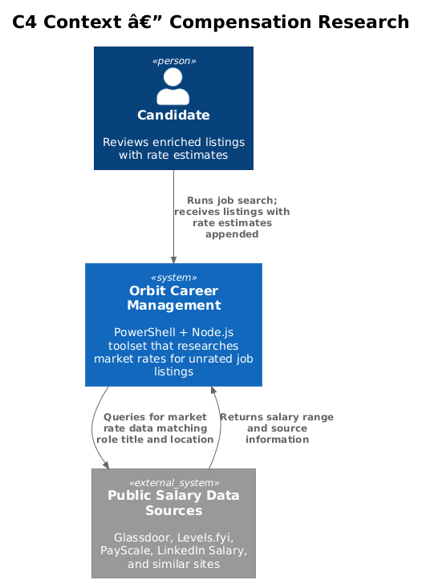
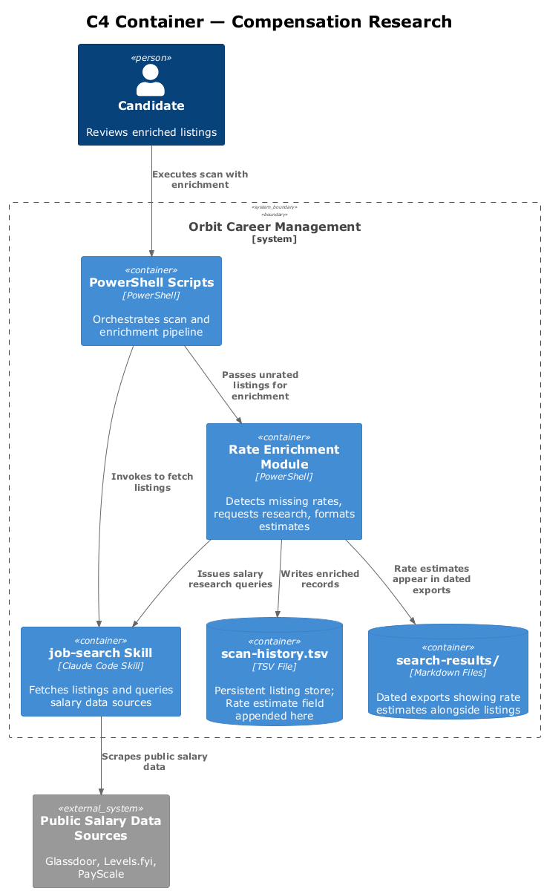
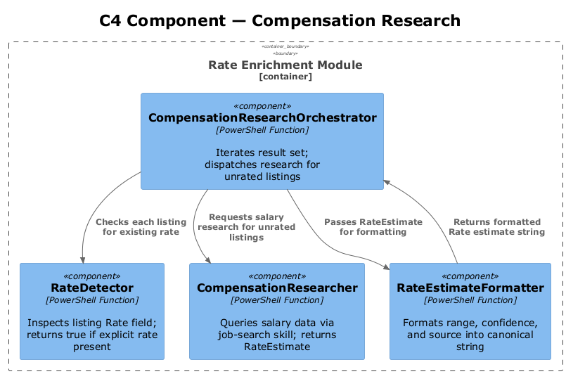
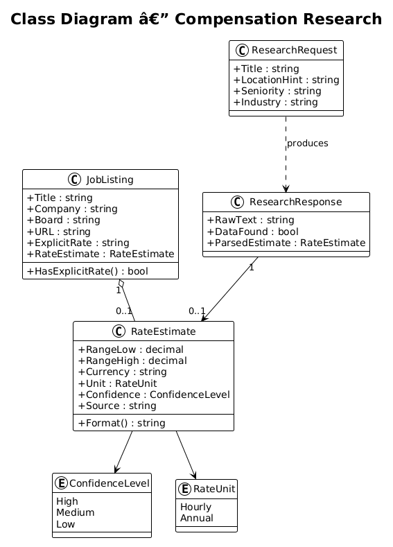
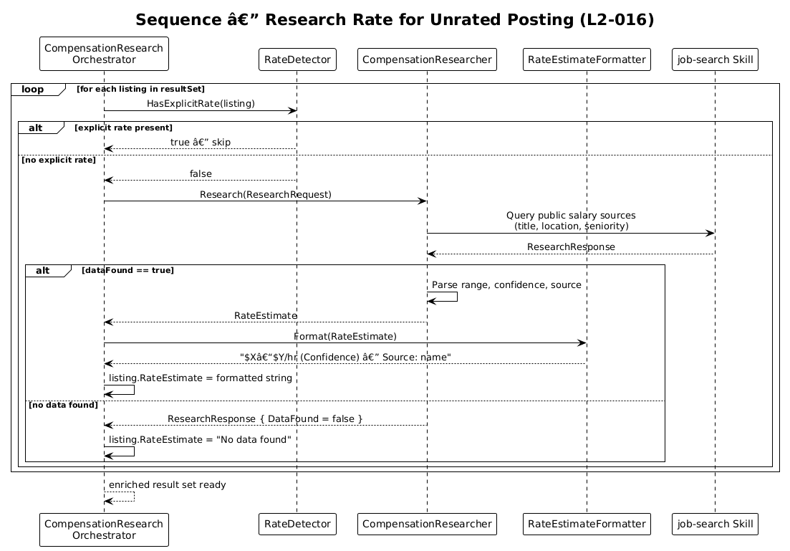

# Feature 07 — Compensation Research — Detailed Design

## 1. Overview

Feature 07 enriches job listings within Orbit that do not advertise compensation by performing targeted market rate research and appending a `Rate estimate` field to each affected listing. Estimates include a salary range, a confidence qualifier, and at least one cited source.

**Stories covered:**
- **L2-016** — Compensation Research for Unrated Postings: when no explicit rate is present, research and report a range with `High`, `Medium`, or `Low` confidence and a named source. If an explicit rate exists, skip research. If no data is found, record "No data found".

**Design constraints:**
- File-based; no database server
- Research is performed by querying publicly available salary data sources
- Estimates must never replace an explicit rate already in the listing
- Confidence must be one of three defined values; free-form qualifiers are not permitted

---

## 2. Architecture

### 2.1 C4 Context Diagram



### 2.2 C4 Container Diagram



### 2.3 C4 Component Diagram



---

## 3. Component Details

### 3.1 CompensationResearchOrchestrator

**Module:** `scripts/modules/Invoke-CompensationResearch.psm1`

Entry point called after the deduplication pass. Iterates over the current result set, identifies listings with no rate, and dispatches research requests.

### 3.2 RateDetector
Inspects a listing's `Rate` field (and optionally the description body) to determine whether an explicit compensation figure is already present. Returns `true` if a rate is found, `false` if the field is absent or blank.

### 3.3 CompensationResearcher
Issues a targeted query against publicly available salary data sources matching the listing's title, industry, and approximate location. Parses the response into a structured `RateEstimate`.

### 3.4 RateEstimateFormatter
Converts a `RateEstimate` into the canonical string `$X–$Y/hr (High|Medium|Low confidence) — Source: <name>` and attaches it to the listing.

---

## 4. Data Model

### 4.1 Class Diagram



### 4.2 Entity Descriptions

| Entity | Description |
|---|---|
| `JobListing` | Enriched version of a scan record; may carry an explicit `Rate` or a `RateEstimate`. |
| `RateEstimate` | Holds `RangeLow`, `RangeHigh`, `Currency`, `Unit` (hr/yr), `Confidence`, and `Source`. |
| `ConfidenceLevel` | Enum: `High`, `Medium`, `Low`. |
| `ResearchRequest` | Parameters passed to `CompensationResearcher`: title, location hint, seniority, industry. |
| `ResearchResponse` | Raw response from the salary data source; parsed into a `RateEstimate` or a no-data sentinel. |

---

## 5. Key Workflows

### 5.1 Research Rate for Unrated Posting



The orchestrator checks each listing. If a rate is already present, it skips to the next listing. Otherwise it calls `CompensationResearcher`, which queries public salary sources. A successful response is formatted and attached. If no usable data is returned, the field is set to "No data found".

---

## 6. API Contracts

This module is invoked automatically by the Job Search Orchestrator (Feature 05) after the deduplication pass and before the dated export is written. It is not a standalone script.

**PowerShell function signatures:**

```powershell
function Invoke-CompensationResearch {
    param (
        [Parameter(Mandatory)] [JobListing[]] $Listings
    )
    # Returns: [JobListing[]] with RateEstimate populated for unrated listings
    # Throws: never — failed research is recorded as "No data found" on the listing
}

function Test-ExplicitRate {
    param (
        [Parameter(Mandatory)] [string] $RateField,
        [string] $DescriptionBody = ""
    )
    # Returns: [bool] — true if an explicit compensation figure is found
}
```

**Caching:** Rate estimates are cached in `data/.rate-cache.json` keyed by `Title + Location`. Cache entries older than 30 days are re-researched on the next run. The cache file must be excluded from version control (`.gitignore`).

**Output format appended to listing (L2-016 AC1–2):**
```
- **Rate estimate**: $X–$Y/hr (High|Medium|Low confidence) — Source: <name>
```
If no data: `- **Rate estimate**: No data found`

---

## 7. Security Considerations

- No salary API credentials are stored in the repository; research queries use publicly accessible data sources only.
- Compensation estimates are advisory; the candidate should verify before negotiating.
- The field label (`Rate estimate`) clearly distinguishes inferred data from employer-stated rates.

---

## 8. Open Questions

1. Should confidence levels be derived from source type (e.g. Glassdoor = High, blog post = Low) or from sample size reported by the source?
2. Should the research query include location if not provided in the listing — and if so, which fallback location should be assumed?
3. How often should cached estimates be refreshed — are they re-researched on every scan or retained until manually cleared?
4. Should "No data found" listings be retried on subsequent runs or permanently marked to avoid redundant queries?
