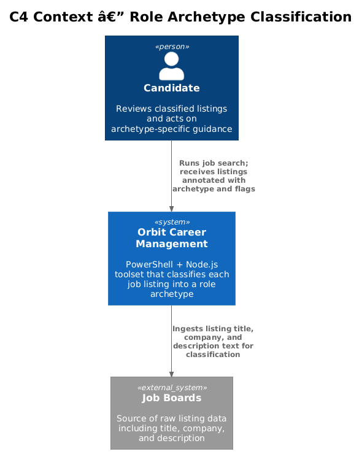
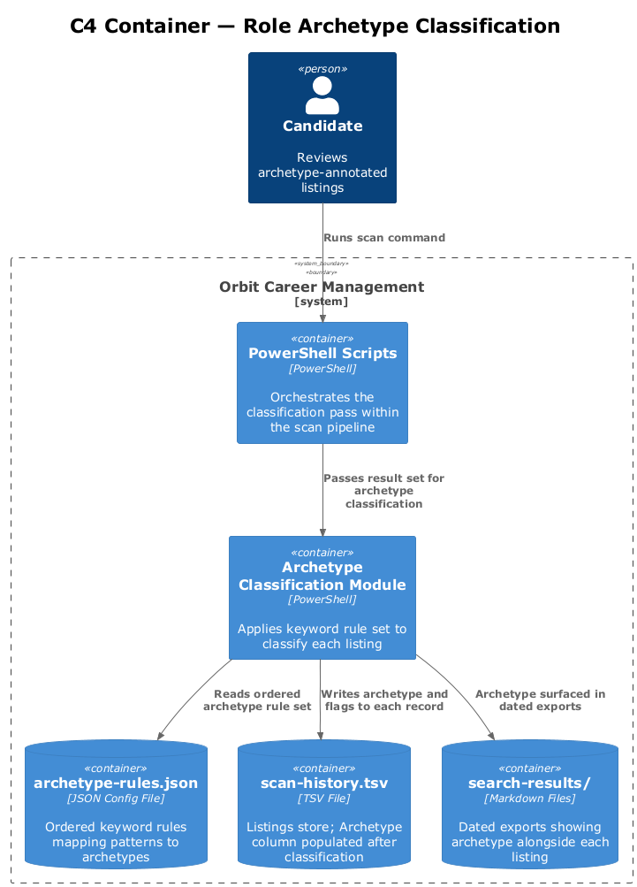
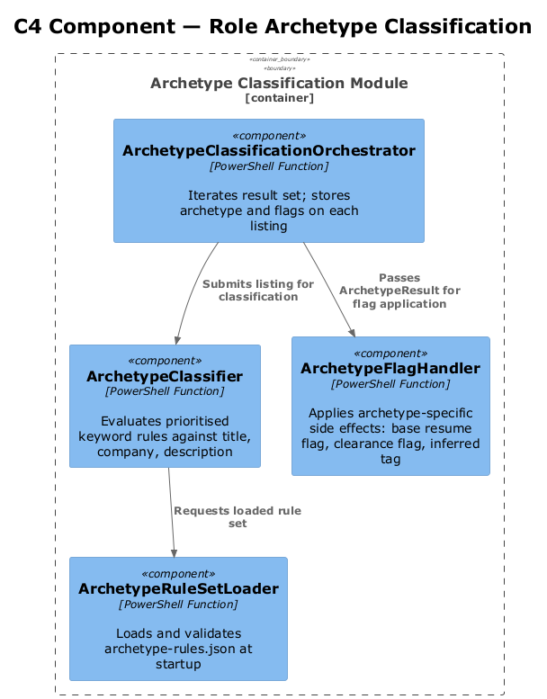
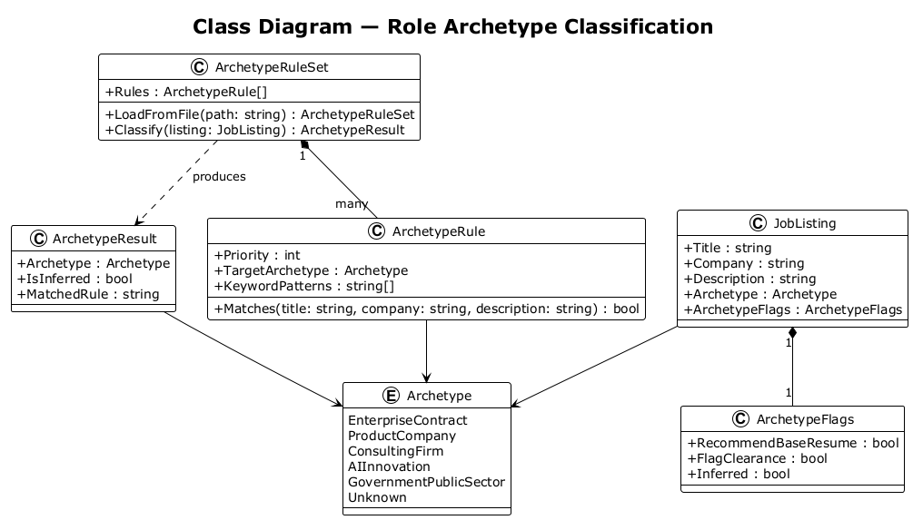
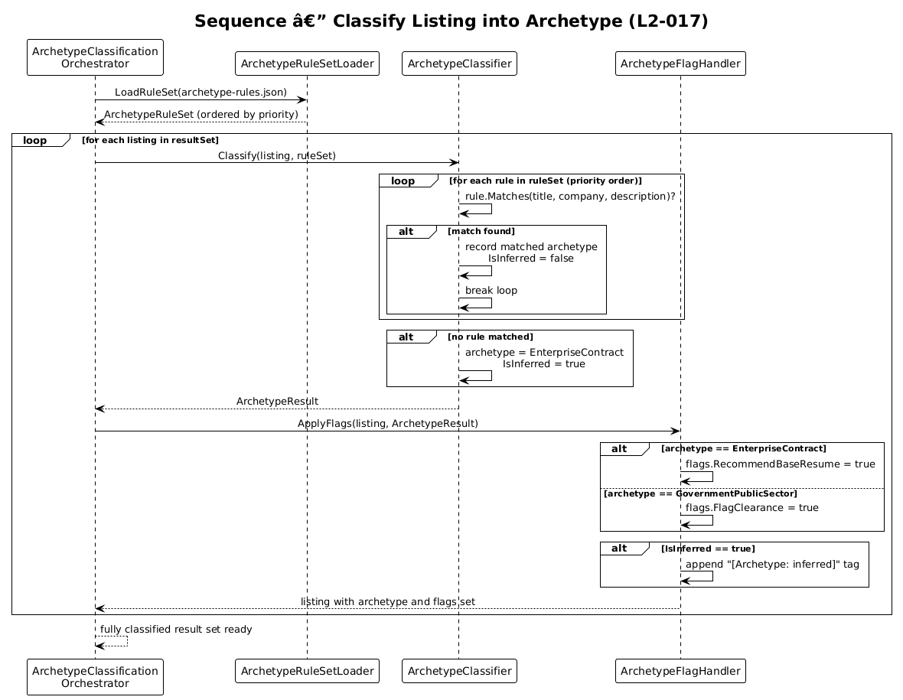

# Role Archetype Classification — Detailed Design

## 1. Overview

Feature 08 classifies every discovered job posting into exactly one of five role archetypes. The archetype informs evaluation weighting, resume tailoring emphasis, and pipeline tracker display. Downstream features (outreach generation, offer evaluation) consume the archetype to apply archetype-specific logic.

**Stories covered:**
- **L2-017** — Role Archetype Classification: classify each listing into one of five archetypes; surface in results, evaluations, and tracker. Apply archetype-specific flags and defaults.

**Archetypes defined:**

| Archetype | Key Signal | Special Rule |
|---|---|---|
| `Enterprise Contract` | Staff aug, contract-to-hire, large SI | Recommend focused base resume |
| `Product Company` | SaaS, ISV, product engineering | — |
| `Consulting Firm` | Agency, advisory, professional services | — |
| `AI / Innovation` | AI/ML, GenAI, R&D, deep tech | — |
| `Government / Public Sector` | Federal, provincial, municipal, crown corp | Flag for security clearance reference |

Unknown postings default to `Enterprise Contract` with `[Archetype: inferred]` flag.

**Design constraints:**
- Every listing must carry exactly one archetype
- Classification is deterministic given the listing content
- No external API calls; classification uses keyword heuristics against title and description

---

## 2. Architecture

### 2.1 C4 Context Diagram

### 2.2 C4 Container Diagram

### 2.3 C4 Component Diagram

---

## 3. Component Details

### ArchetypeClassificationOrchestrator
Iterates the post-deduplication result set and dispatches each listing to the classifier. Stores the archetype and any flags back onto the listing record.

### ArchetypeClassifier
Applies a prioritised keyword rule set against the listing title, company name, and description body. Returns an `ArchetypeResult` containing the matched archetype and a boolean `isInferred` flag.

### ArchetypeRuleSet
Configuration data: an ordered list of archetype rules, each containing a set of keyword patterns and a target archetype. Evaluated in priority order; first match wins.

### ArchetypeFlagHandler
Post-processes the classified listing to apply archetype-specific side effects: recommending the base resume for `Enterprise Contract`, adding a security clearance flag for `Government / Public Sector`, and appending `[Archetype: inferred]` when no rule matched.

---

## 4. Data Model

### 4.1 Class Diagram

### 4.2 Entity Descriptions

| Entity | Description |
|---|---|
| `JobListing` | Extended with `Archetype` and `ArchetypeFlags` fields after classification. |
| `ArchetypeResult` | Output of classification: the matched `Archetype` enum value and `IsInferred` boolean. |
| `Archetype` | Enum of the five defined archetypes plus an `Unknown` sentinel. |
| `ArchetypeRule` | One rule in the rule set: a priority rank, a list of keyword patterns, and a target archetype. |
| `ArchetypeRuleSet` | Ordered collection of `ArchetypeRule` entries; evaluated top-to-bottom. |
| `ArchetypeFlags` | Bit-set of flags applied post-classification: `RecommendBaseResume`, `FlagClearance`, `Inferred`. |

---

## 5. Key Workflows

### 5.1 Classify Listing

Each listing passes through the classifier, which evaluates rules in priority order. The first matching rule determines the archetype. If no rule matches, `Enterprise Contract` is assigned with the `Inferred` flag. Post-classification, `ArchetypeFlagHandler` applies any archetype-specific side effects before the listing is written back to the result set.

---

## 6. Security Considerations

- The `Government / Public Sector` archetype triggers a clearance flag, ensuring the candidate does not omit clearance references from applications to those roles.
- Classification rules are stored in plaintext configuration; they do not contain sensitive data.
- Misclassification to `Enterprise Contract` is the safe default; it never silently drops a security-relevant flag.

---

## 7. Open Questions

1. Should the rule set be stored in a dedicated `config/archetype-rules.json` file to allow updates without touching scripts?
2. How should multi-signal listings be handled — e.g. a government AI contract that matches both `AI / Innovation` and `Government / Public Sector`?
3. Should classification confidence be tracked separately from the `Inferred` flag for reporting purposes?
4. Is a manual override mechanism needed (e.g. a comment in the TSV) to correct misclassified listings without re-running the full pipeline?
