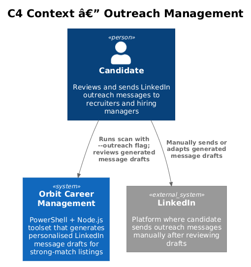
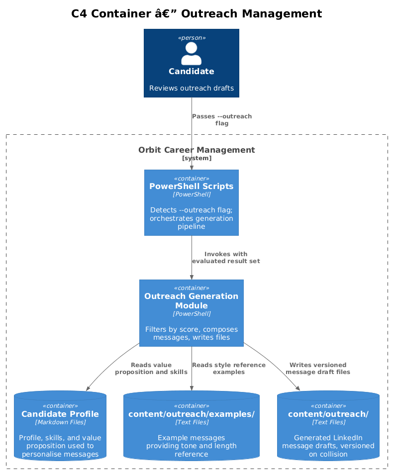
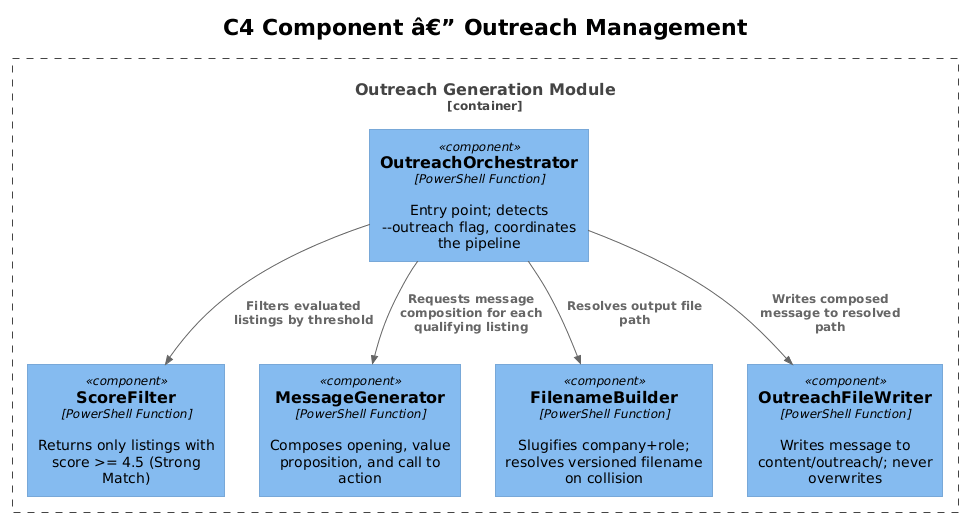
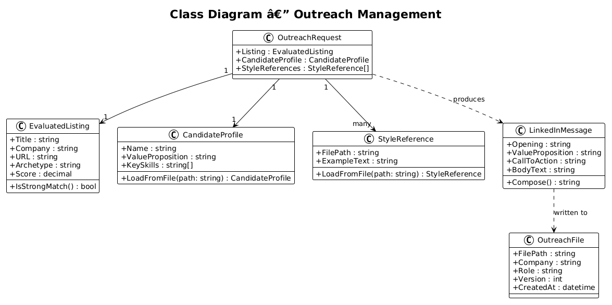
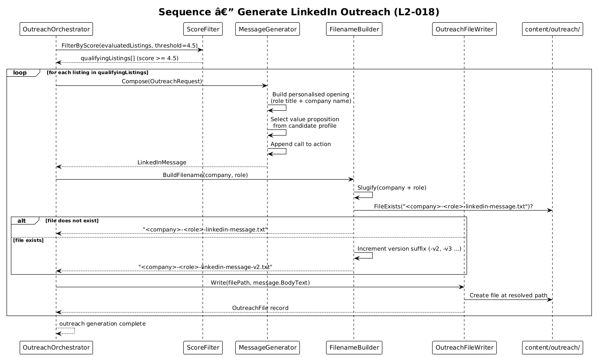

# Outreach Management — Detailed Design

## 1. Overview

Feature 09 generates personalised LinkedIn outreach message drafts for high-scoring job listings, organising them in a dedicated directory. Message drafts draw on existing style reference examples and on offer evaluation context to produce personalised, actionable messages.

**Stories covered:**
- **L2-018** — LinkedIn Outreach Generation: when `--outreach` flag is passed, generate a personalised LinkedIn message draft for each "Strong Match" (score ≥ 4.5) listing, saved to `content/outreach/<company>-<role>-linkedin-message.txt`. Score < 4.5 → no file. Existing file → create with `-v2` suffix (never overwrite).

**Message requirements:**
- Personalised opening referencing the specific role and company
- 2–3 sentence value proposition drawn from candidate profile
- Clear call to action

**Design constraints:**
- Output directory: `content/outreach/`
- File naming: `<company>-<role>-linkedin-message.txt` (slug-normalised)
- Never overwrite; version suffix `-v2`, `-v3`, etc. on collision
- Only `--outreach` flag triggers generation; default scan does not produce outreach files

---

## 2. Architecture

### 2.1 C4 Context Diagram

### 2.2 C4 Container Diagram

### 2.3 C4 Component Diagram

---

## 3. Component Details

### OutreachOrchestrator
Activated when `--outreach` flag is detected. Filters the evaluated result set to listings with score ≥ 4.5 and dispatches each to the message generator.

### ScoreFilter
Reads the `Score` field from each evaluated listing. Returns only listings meeting the "Strong Match" threshold (≥ 4.5). Listings below threshold are silently skipped — no file, no log entry.

### MessageGenerator
Composes the LinkedIn message by combining:
1. A personalised opening (role title + company name)
2. A value proposition block drawn from the candidate profile markdown
3. A call to action

Uses style reference files from `content/outreach/examples/` to match tone and length.

### FilenameBuilder
Constructs the output filename from company and role strings: slugifies (lowercase, hyphens), appends `-linkedin-message.txt`. Checks for collisions and appends version suffix if needed.

### OutreachFileWriter
Writes the composed message to `content/outreach/`. Never overwrites; always creates a versioned file on collision.

---

## 4. Data Model

### 4.1 Class Diagram

### 4.2 Entity Descriptions

| Entity | Description |
|---|---|
| `EvaluatedListing` | A job listing that has been scored; carries a `Score` (decimal 1–5) and archetype. |
| `OutreachRequest` | Parameters for generating one message: listing details, candidate profile snapshot, style references. |
| `LinkedInMessage` | Composed message with `Opening`, `ValueProposition`, `CallToAction`, and final `BodyText`. |
| `OutreachFile` | The persisted file record: `FilePath`, `Company`, `Role`, `Version`, `CreatedAt`. |
| `StyleReference` | An example message from `content/outreach/examples/` used as tone and length guidance. |

---

## 5. Key Workflows

### 5.1 Generate LinkedIn Outreach

When `--outreach` is passed, `OutreachOrchestrator` filters listings by score. For each qualifying listing, `MessageGenerator` composes a personalised message, `FilenameBuilder` resolves the output path (with version suffix if needed), and `OutreachFileWriter` persists the file without overwriting any existing version.

---

## 6. Security Considerations

- Outreach files may contain personalised details about the candidate's positioning; the `content/outreach/` directory should be gitignored if the repository is public.
- Style reference examples should not contain real names, email addresses, or phone numbers from prior outreach without explicit consent.
- No external API calls are made during outreach generation; all content is assembled locally from candidate profile files.

---

## 7. Open Questions

1. Should the score threshold (4.5) be configurable in `config.json`, or is it a fixed business rule?
2. Should email drafts and recruiter follow-ups (mentioned in L1-009) be generated in the same pipeline or as a separate `--email-outreach` flag?
3. How should the slug normalisation handle special characters in company names (e.g. ampersands, dots, brackets)?
4. Should a manifest file (e.g. `content/outreach/manifest.json`) track all generated files and their versions for the pipeline tracker?
5. What is the maximum version number before the candidate should be warned that many outreach drafts exist for one listing?
