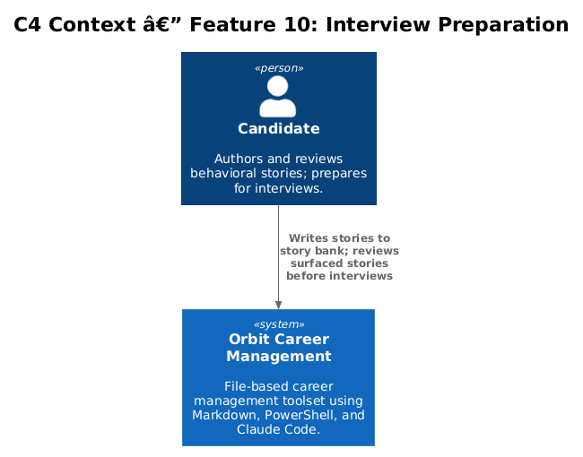
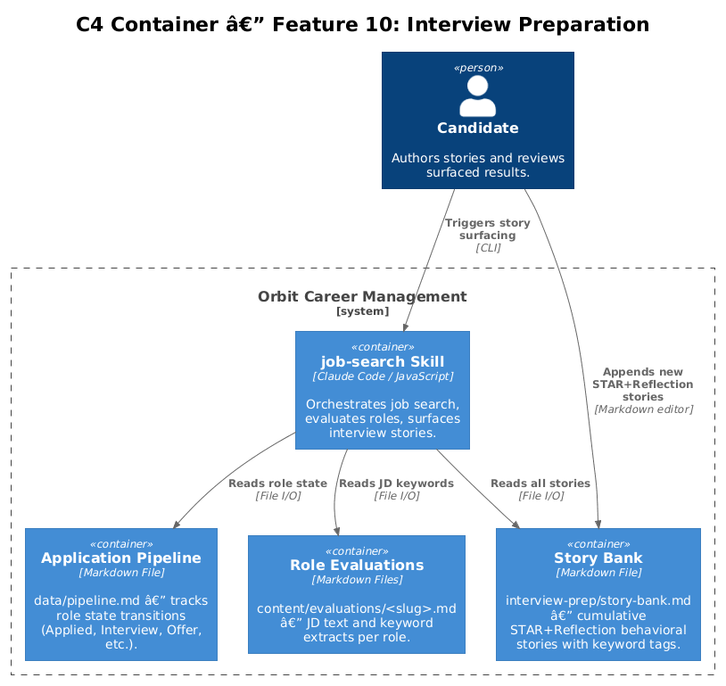
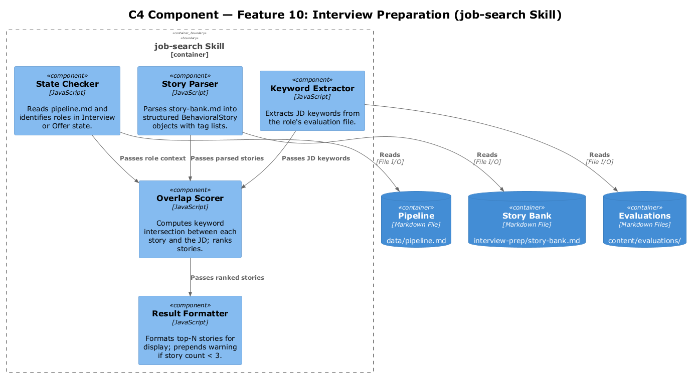
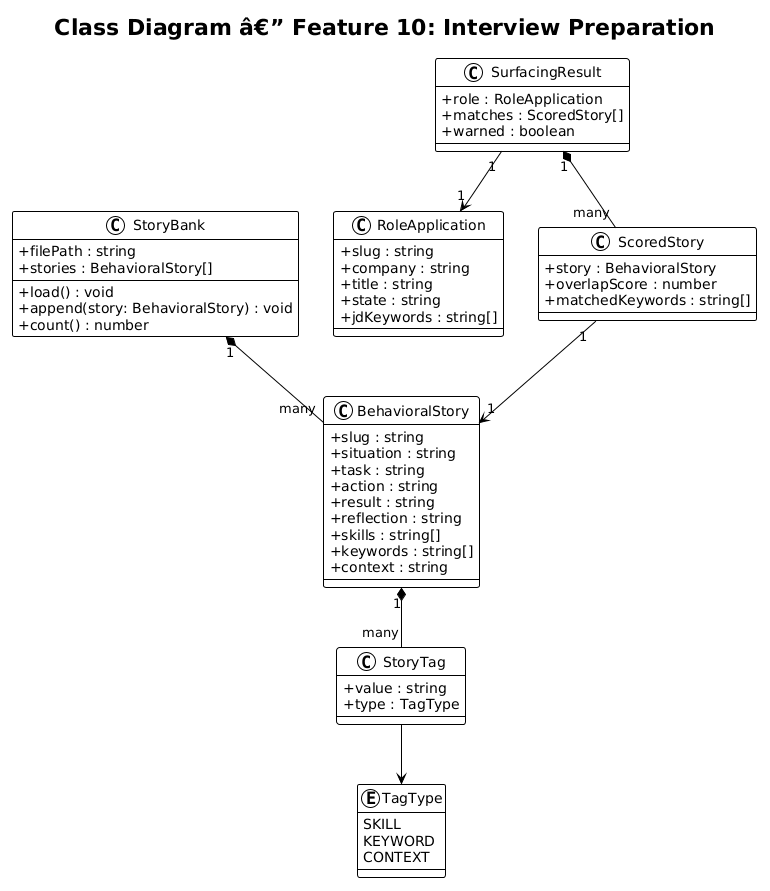
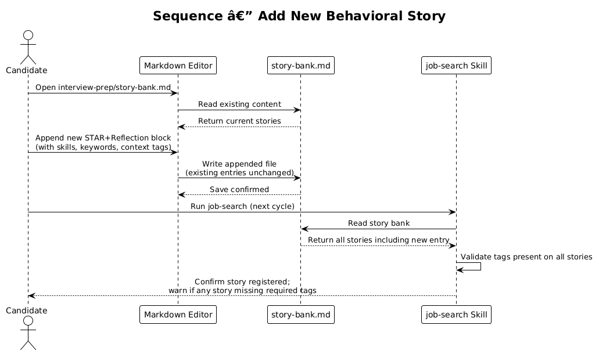
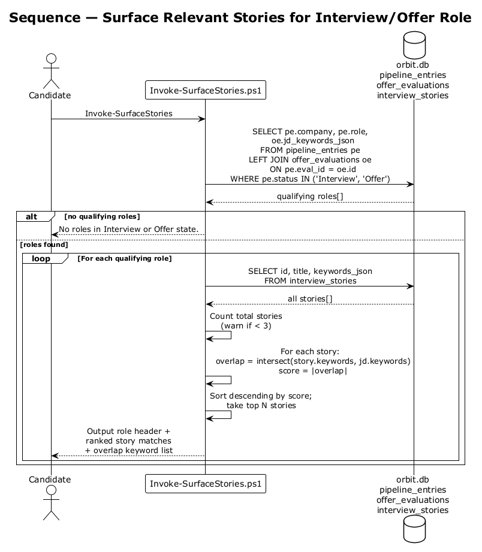

# Feature 10 — Interview Preparation: Detailed Design

## 1. Overview

Feature 10 maintains a cumulative bank of STAR+Reflection behavioral stories in the `interview_stories` table of the Orbit SQLite database. Stories are linked to the candidate's work history via keyword and skills tags. They are surfaced during offer evaluation and after a pipeline entry reaches the `Interview` stage, via a keyword-overlap SQL query against the role's job description keywords.

**In-scope requirements:**

| ID | Requirement |
|----|-------------|
| L1-010 | Maintain a cumulative behavioral story bank in the database; surface relevant stories at Interview and Offer stages via keyword-overlap queries. |
| L2-019 | `interview_stories` table — STAR+Reflection format, `keywords` JSON array. Surface ≥2 relevant stories by keyword overlap. Warn if fewer than 3 stories exist. Append-only (INSERT only; no UPDATE or DELETE). |

**Out of scope:** Automated story generation, AI story scoring, real-time interview coaching.

---

## 2. Architecture

### 2.1 C4 Context Diagram



The candidate interacts with the story bank via PowerShell scripts (add story, surface stories) and indirectly through the job-search skill when an application reaches the Interview or Offer stage.

### 2.2 C4 Container Diagram



The `interview_stories` table in `data/orbit.db` is the sole data store. Two scripts — `Add-InterviewStory.ps1` and the story surfacing query in the job-search skill — interact with it.

### 2.3 C4 Component Diagram



---

## 3. Component Details

### 3.1 `interview_stories` Table

See `db/schema.sql` for full definition. Key columns:

| Column | Type | Description |
|--------|------|-------------|
| `id` | INTEGER PK | Auto-increment |
| `title` | TEXT | Short name for the story |
| `context` | TEXT | Company/role/period the story comes from |
| `situation` | TEXT | S in STAR |
| `task` | TEXT | T in STAR |
| `action` | TEXT | A in STAR |
| `result` | TEXT | R in STAR |
| `reflection` | TEXT | Post-STAR learning/growth note |
| `skills` | TEXT | JSON array of skill labels |
| `keywords` | TEXT | JSON array of JD-mappable terms |
| `created_at` | TEXT | Insert timestamp |

Append-only by convention: application code must not issue UPDATE or DELETE against this table.

### 3.2 Story Surfacing Component

Triggered when a `pipeline_entries` row has `status = 'Interview'` or `'Offer'`. Runs a keyword-overlap query:

```sql
SELECT id, title, situation, task, action, result, reflection, keywords,
       (
           SELECT COUNT(*) FROM json_each(keywords) AS k
           WHERE lower(k.value) IN (SELECT lower(value) FROM json_each(?))
       ) AS overlap_score
FROM interview_stories
ORDER BY overlap_score DESC, id DESC
LIMIT 5;
```

Where `?` is the JSON array of keywords extracted from the role's job description (sourced from the `notes` column of the relevant `offer_evaluations` row or from the job listing body).

Returns top-N stories sorted by overlap. Emits a warning if `SELECT COUNT(*) FROM interview_stories < 3`.

### 3.3 `scripts/Add-InterviewStory.ps1`

Prompts the candidate for each STAR+Reflection field, then:

```powershell
function Add-InterviewStory {
    param (
        [Parameter(Mandatory)] [string] $Title,
        [Parameter(Mandatory)] [string] $Context,
        [Parameter(Mandatory)] [string] $Situation,
        [Parameter(Mandatory)] [string] $Task,
        [Parameter(Mandatory)] [string] $Action,
        [Parameter(Mandatory)] [string] $Result,
        [Parameter(Mandatory)] [string] $Reflection,
        [string[]] $Skills   = @(),
        [string[]] $Keywords = @()
    )
    # Inserts one row into interview_stories
    # Returns: [int] id of the new row
}
```

---

## 4. Data Model

### 4.1 Class Diagram



### 4.2 Entity Descriptions

| Entity | Description |
|--------|-------------|
| `InterviewStory` | Maps to an `interview_stories` row. Immutable after insert. |
| `StoryTag` | A keyword or skill string stored in the JSON arrays. |
| `SurfacingResult` | Output of the overlap query: ordered list of stories with `overlap_score`. |
| `RoleApplication` | A `pipeline_entries` row at `Interview` or `Offer` status. Provides the keyword list for surfacing. |

---

## 5. Key Workflows

### 5.1 Adding a New Story



The candidate runs `Add-InterviewStory.ps1`, fills in each STAR+Reflection field interactively, and provides keyword and skill tags. The script INSERTs one row. Existing rows are never modified.

### 5.2 Surfacing Relevant Stories



When the job-search skill detects a `pipeline_entries` row at `Interview` or `Offer` status, it extracts JD keywords, runs the overlap query against `interview_stories`, and outputs the top matches. If fewer than 3 stories exist, a warning is prepended to the output.

---

## 6. API Contracts

```powershell
function Get-RelevantStories {
    param (
        [Parameter(Mandatory)] [string[]] $JdKeywords,  # keywords from JD
        [int] $TopN = 5
    )
    # Returns: [PSCustomObject[]] sorted by overlap_score DESC
    # Emits: warning to stdout if total story count < 3
}
```

---

## 7. Security Considerations

- `interview_stories` rows contain personal career history; `data/orbit.db` is gitignored (L2-024)
- No external API calls during story surfacing
- The append-only convention is enforced at the application layer; the schema has no trigger preventing UPDATE/DELETE (rely on code discipline and code review)

---

## 8. Open Questions

| # | Question | Owner | Status |
|---|----------|-------|--------|
| 1 | Should story `overlap_score` be persisted per evaluation, or always recomputed? | — | Open |
| 2 | Should there be a maximum recommended story bank size? | — | Open |
| 3 | Should stories support a `deprecated` flag to soft-remove outdated narratives without deleting them? | — | Open |
