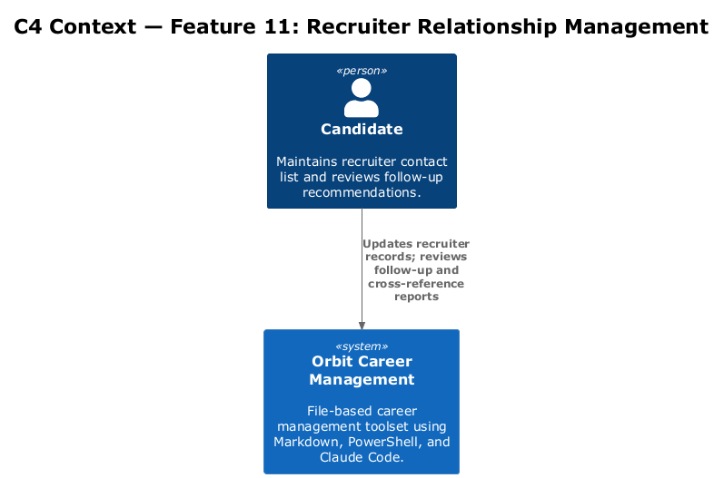
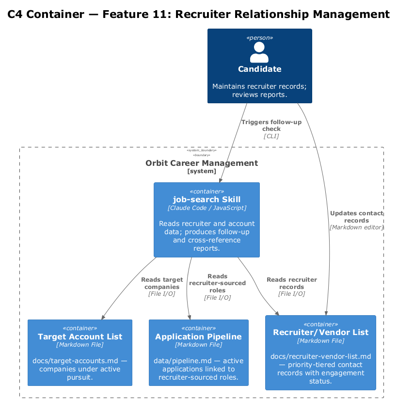
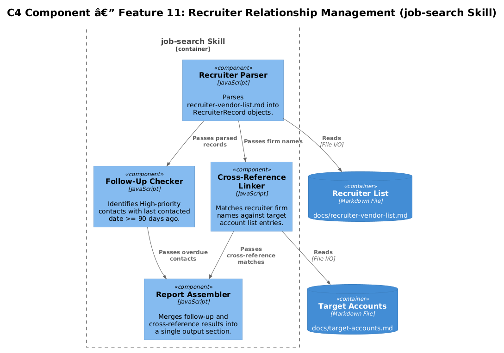
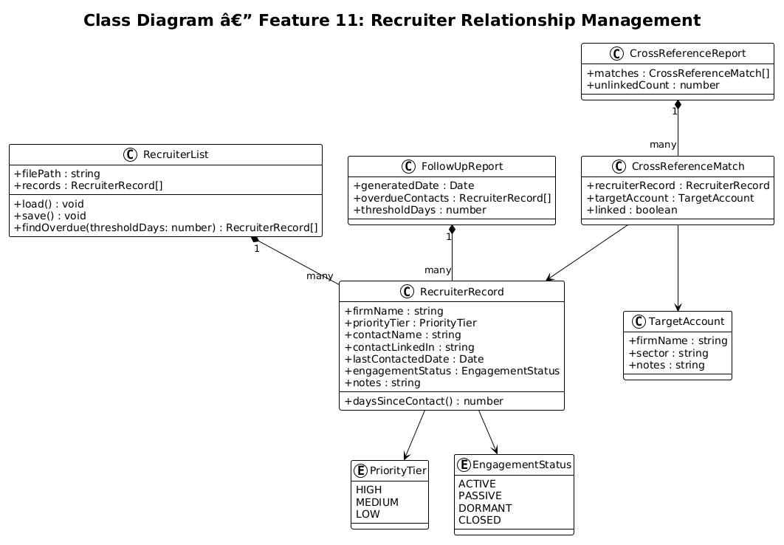
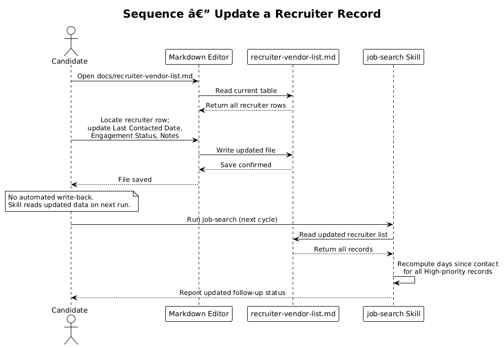
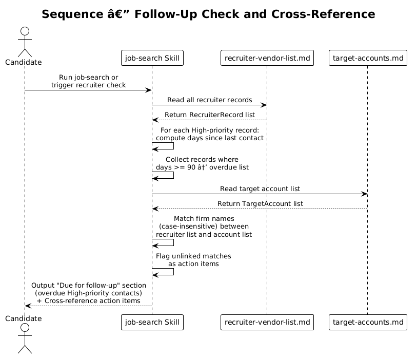

# Feature 11 — Recruiter Relationship Management: Detailed Design

## 1. Overview

Feature 11 tracks recruiter and staffing vendor relationships in the `recruiter_contacts` table of the Orbit SQLite database. Target company accounts are stored in `target_accounts`, with a foreign key linking companies that also appear as recruiter vendors. The feature surfaces high-priority contacts overdue for follow-up via SQL queries and cross-references staffing vendors with the target account list.

**In-scope requirements:**

| ID | Requirement |
|----|-------------|
| L1-011 | Track recruiter/vendor contact info, last contacted date, engagement status, and priority tier; integrate with the application pipeline via the database. |
| L2-020 | `recruiter_contacts` table with: `firm_name`, `priority_tier`, `contact_name`, `contact_linkedin`, `opportunity_page_url`, `last_contacted_date`, `engagement_status`, `notes`. High-priority contacts not updated in 90+ days surfaced as "Due for follow-up". Cross-reference via `target_accounts.recruiter_contact_id` FK. |

**Out of scope:** Automated outreach sending, CRM integration, email parsing.

---

## 2. Architecture

### 2.1 C4 Context Diagram



The candidate maintains recruiter data via PowerShell scripts and queries. The job-search skill reads both `recruiter_contacts` and `target_accounts` to produce follow-up and cross-reference reports.

### 2.2 C4 Container Diagram



`recruiter_contacts` and `target_accounts` tables in `data/orbit.db` are the data layer. The `Invoke-RecruiterCrm.psm1` module wraps all DB operations.

### 2.3 C4 Component Diagram



---

## 3. Component Details

### 3.1 `recruiter_contacts` Table

See `db/schema.sql` for full definition.

| Column | Type | Description |
|--------|------|-------------|
| `firm_name` | TEXT UNIQUE | Recruiter or staffing vendor name |
| `contact_name` | TEXT | Primary contact at the firm |
| `contact_linkedin` | TEXT | LinkedIn profile URL |
| `priority_tier` | TEXT | High / Medium / Low (CHECK constraint) |
| `opportunity_page_url` | TEXT | URL of their job listings page |
| `last_contacted_date` | TEXT | ISO date of last interaction |
| `engagement_status` | TEXT | Active / Passive / Dormant / Closed (CHECK) |
| `notes` | TEXT | Free-text context |

### 3.2 `target_accounts` Table

See `db/schema.sql`. Key columns:

| Column | Type | Description |
|--------|------|-------------|
| `name` | TEXT UNIQUE | Company name |
| `career_page_url` | TEXT | ATS or career page URL |
| `ats_type` | TEXT | Detected ATS platform (CHECK constraint) |
| `recruiter_contact_id` | INTEGER FK | → `recruiter_contacts.id` when firm appears on both lists |

### 3.3 Follow-Up Checker

```sql
SELECT * FROM recruiter_contacts
WHERE priority_tier = 'High'
  AND (last_contacted_date IS NULL
       OR last_contacted_date <= date('now', '-90 days'));
```

Returns contacts overdue for follow-up. Output surfaced in the "Due for follow-up" section of the job-search skill report.

### 3.4 Cross-Reference Linker

```sql
SELECT ta.name, rc.id AS recruiter_contact_id
FROM target_accounts ta
JOIN recruiter_contacts rc ON lower(ta.name) = lower(rc.firm_name)
WHERE ta.recruiter_contact_id IS NULL;
```

Returns unlinked matches as action items. The linker updates `target_accounts.recruiter_contact_id` for each match found.

### 3.5 `scripts/modules/Invoke-RecruiterCrm.psm1`

```powershell
function Add-RecruiterContact    { ... }   # INSERT into recruiter_contacts
function Update-RecruiterContact { ... }   # UPDATE last_contacted_date, engagement_status, notes
function Get-FollowUpDue         { ... }   # 90-day overdue query
function Set-AccountCrossRef     { ... }   # UPDATE target_accounts.recruiter_contact_id
function Add-TargetAccount       { ... }   # INSERT into target_accounts
```

---

## 4. Data Model

### 4.1 Class Diagram



### 4.2 Entity Descriptions

| Entity | Description |
|--------|-------------|
| `RecruiterContact` | Maps to a `recruiter_contacts` row. |
| `PriorityTier` | CHECK constraint enum: High, Medium, Low. |
| `EngagementStatus` | CHECK constraint enum: Active, Passive, Dormant, Closed. |
| `TargetAccount` | Maps to a `target_accounts` row; may carry a `recruiter_contact_id` FK. |
| `FollowUpReport` | Output of the 90-day query: list of overdue High-priority contacts. |
| `CrossReferenceReport` | Output of the JOIN query: matched firm names with link status. |

---

## 5. Key Workflows

### 5.1 Updating a Recruiter Record



The candidate runs `Update-RecruiterContact -FirmName "..." -LastContactedDate (Get-Date -Format 'yyyy-MM-dd') -EngagementStatus Active`. The module executes `UPDATE recruiter_contacts SET last_contacted_date = ?, engagement_status = ?, updated_at = datetime('now') WHERE firm_name = ?`.

### 5.2 Checking for Follow-Up Due



The job-search skill calls `Get-FollowUpDue`. The module runs the 90-day query, returns matching rows, and the skill renders them in a "Due for follow-up" section. It also runs the cross-reference linker in the same pass and auto-updates any unlinked `target_accounts` rows.

---

## 6. API Contracts

```powershell
function Get-FollowUpDue {
    # No parameters
    # Returns: [PSCustomObject[]] recruiter_contacts rows overdue for High-priority follow-up
}

function Set-AccountCrossRef {
    # No parameters
    # Side effect: UPDATE target_accounts.recruiter_contact_id for each matching firm
    # Returns: [int] count of rows updated
}
```

---

## 7. Security Considerations

- `recruiter_contacts` contains personal LinkedIn URLs and contact names; `data/orbit.db` is gitignored (L2-024)
- No recruiter data is sent to external services; all processing is local
- The `UPDATE` function uses parameterised queries only; no string interpolation into SQL

---

## 8. Open Questions

| # | Question | Owner | Status |
|---|----------|-------|--------|
| 1 | Should Medium-priority recruiters have a configurable follow-up threshold (e.g. 180 days)? | — | Open |
| 2 | Should duplicate firm names (parent/subsidiary) be handled via a `parent_id` self-referencing FK? | — | Open |
| 3 | Should the quarterly review reminder be surfaced automatically on a schedule, or only on manual trigger? | — | Open |
