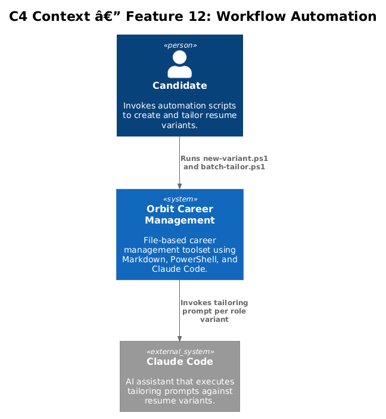
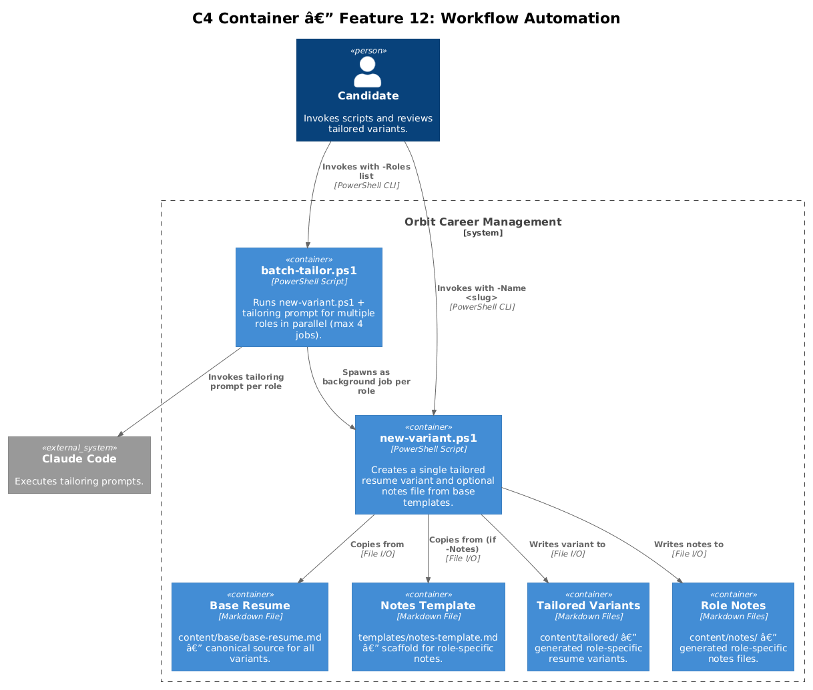
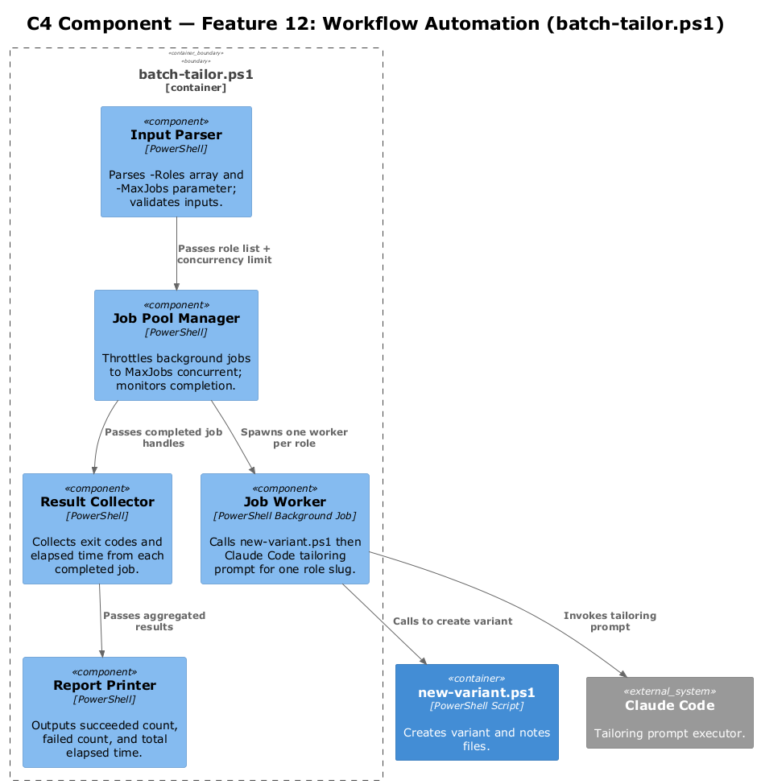
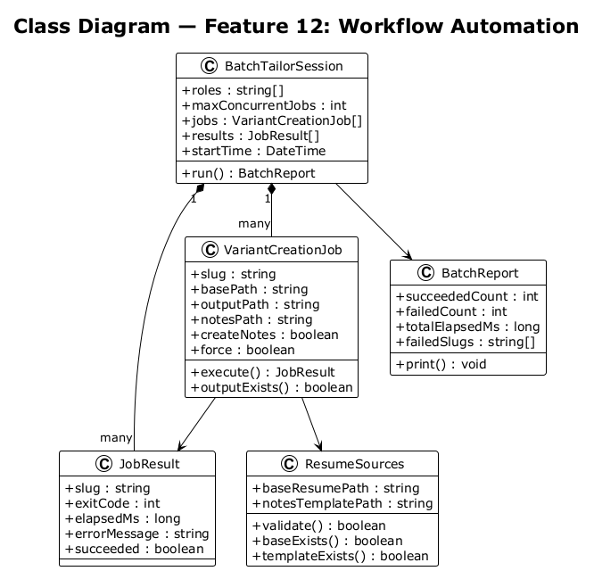
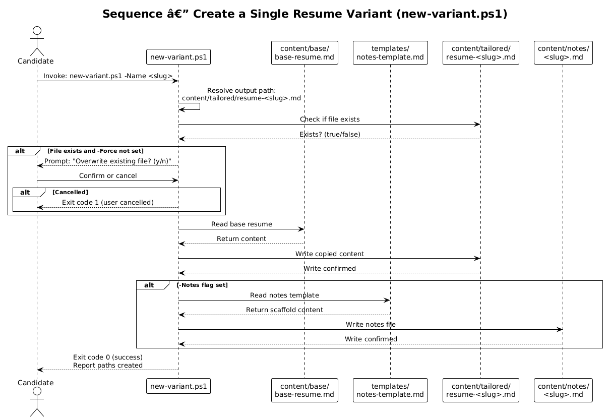
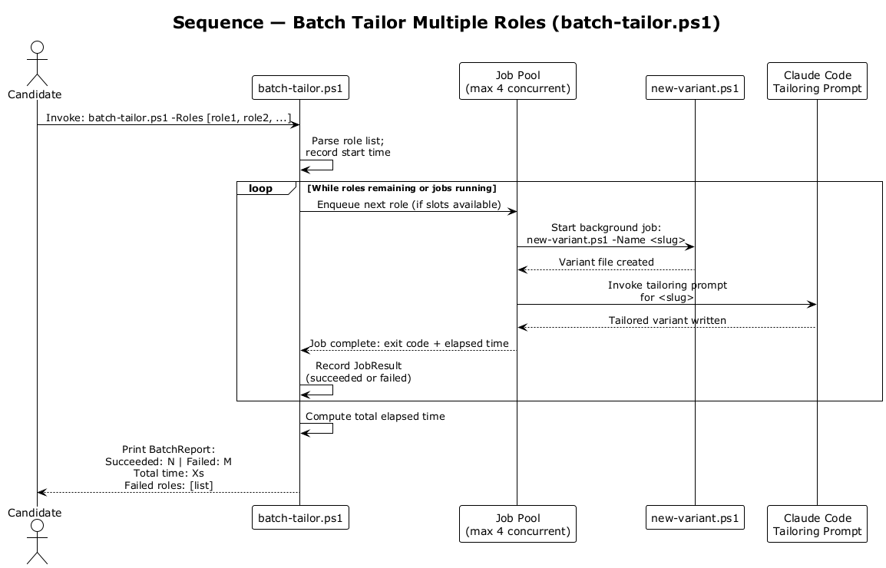

# Feature 12 — Workflow Automation: Detailed Design

## 1. Overview

Feature 12 automates multi-step workflows to reduce manual effort during high-volume job searches. It covers individual tailored resume variant creation and batch parallel tailoring across multiple roles.

**In-scope requirements:**

| ID | Requirement |
|----|-------------|
| L1-012 | Automate variant creation, batch tailoring, document build, and base resume sync verification. Support parallel execution during high-volume search. |
| L2-021 | `new-variant.ps1 -Name <slug>` creates `content/tailored/resume-<name>.md` from base file. `-Notes` flag creates `content/notes/<name>.md` from template. Warns before overwriting. |
| L2-022 | `scripts/batch-tailor.ps1` accepts list of role names, runs `new-variant.ps1` and a Claude Code tailoring prompt for each role in parallel (max 4 concurrent jobs). Reports succeeded, failed, total elapsed time. |

**Out of scope:** Automated PDF upload, ATS submission, AI-only unreviewed tailoring.

---

## 2. Architecture

### 2.1 C4 Context Diagram

The candidate invokes PowerShell scripts that read from template and base resume files, produce tailored variants, and optionally trigger Claude Code for content tailoring.

### 2.2 C4 Container Diagram

Two PowerShell scripts (`new-variant.ps1`, `batch-tailor.ps1`) orchestrate file copying and Claude Code invocations. The base resume and notes template serve as source inputs; the tailored content directory receives outputs.

### 2.3 C4 Component Diagram

`batch-tailor.ps1` internally manages a job pool limited to 4 concurrent PowerShell background jobs, each wrapping a `new-variant.ps1` invocation plus a tailoring prompt call.

---

## 3. Component Details

### `new-variant.ps1`

- **Parameters:** `-Name <slug>` (required), `-Notes` (switch), `-Force` (switch to suppress overwrite warning).
- **Behavior:**
  1. Resolves output path: `content/tailored/resume-<slug>.md`.
  2. If output file exists and `-Force` not set: prompt user for confirmation before overwriting.
  3. Copies `content/base/base-resume.md` to the resolved path.
  4. If `-Notes` set: copies `templates/notes-template.md` to `content/notes/<slug>.md`.
- **Exit codes:** `0` success, `1` user-cancelled overwrite, `2` source file missing.

### `scripts/batch-tailor.ps1`

- **Parameters:** `-Roles` (string array of slugs), `-MaxJobs` (default 4).
- **Behavior:**
  1. Iterates role slug list.
  2. Starts a background job for each role calling `new-variant.ps1` then the Claude Code tailoring prompt.
  3. Throttles to `MaxJobs` concurrent jobs using a job pool loop.
  4. Collects exit codes from completed jobs.
  5. Reports summary: succeeded count, failed count, total elapsed time.
- **Job isolation:** Each background job has its own process; failures do not cancel siblings.

### Templates

- `templates/notes-template.md` — scaffold for role-specific notes with placeholder sections.
- `content/base/base-resume.md` — canonical base resume; read-only during batch operations.

---

## 4. Data Model

### 4.1 Class Diagram

### 4.2 Entity Descriptions

| Entity | Description |
|--------|-------------|
| `VariantCreationJob` | Represents a single `new-variant.ps1` invocation with input parameters and output path. |
| `BatchTailorSession` | A batch run: list of role slugs, max concurrency, job pool state, and final report. |
| `JobResult` | Outcome of a single background job: role slug, exit code, elapsed time, error message. |
| `BatchReport` | Aggregated summary: succeeded count, failed count, total elapsed time. |
| `ResumeSources` | Paths to base resume and notes template; validated before any variant is written. |

---

## 5. Key Workflows

### 5.1 Creating a Single Variant

`new-variant.ps1` resolves the output path, checks for existing files, copies the base resume, and optionally copies the notes template. The candidate reviews and tailors the variant manually or triggers the Claude Code tailoring prompt.

### 5.2 Batch Tailoring Multiple Roles

`batch-tailor.ps1` feeds role slugs into a throttled background job pool. Each job creates a variant and runs the tailoring prompt in sequence. The orchestrator collects results and prints a summary report when all jobs complete.

---

## 6. Security Considerations

- `content/tailored/` and `content/notes/` are excluded from version control (see L2-024) to prevent accidental publication of tailored personal documents.
- `new-variant.ps1` never modifies the base resume; it only reads it.
- The overwrite warning in `new-variant.ps1` prevents silent data loss during re-runs.
- Batch jobs run with the same user credentials as the invoking shell; no privilege escalation occurs.

---

## 7. Open Questions

| # | Question | Owner | Status |
|---|----------|-------|--------|
| 1 | Should `batch-tailor.ps1` support a dry-run mode that lists what would be created without writing files? | — | Open |
| 2 | Should failed jobs automatically retry once, or require manual re-run? | — | Open |
| 3 | Is `-MaxJobs 4` the right ceiling for local machine performance, or should it be configurable via `config/profile.yml`? | — | Open |
