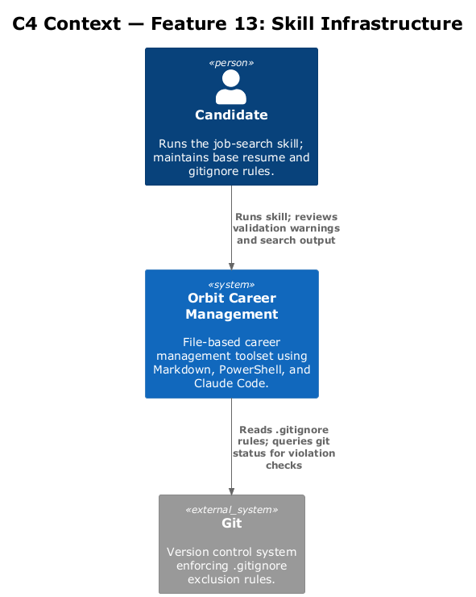
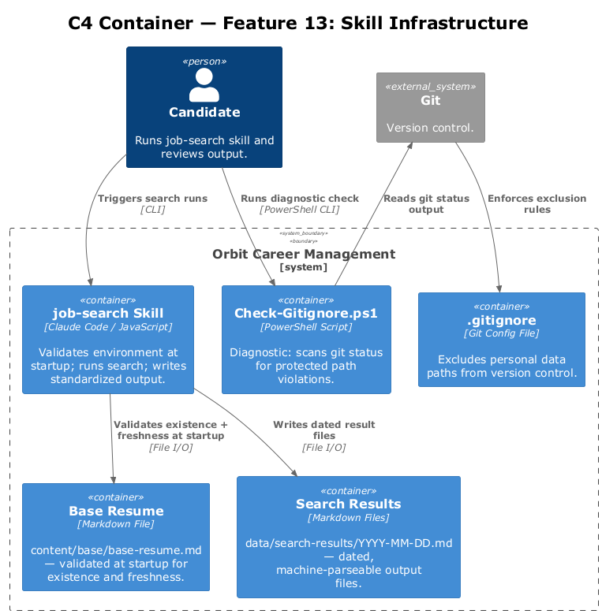
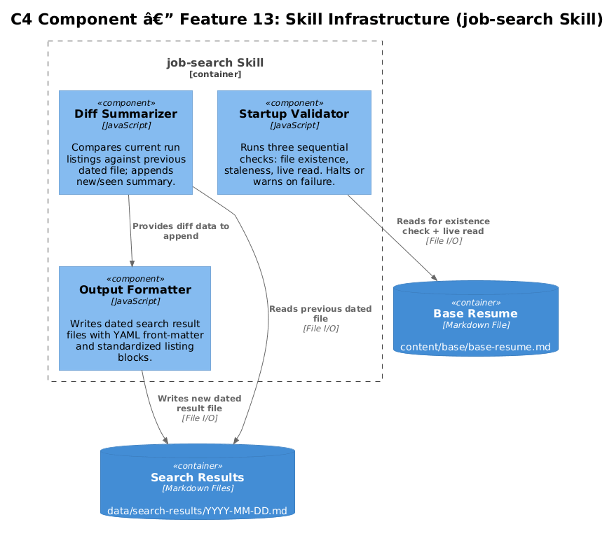
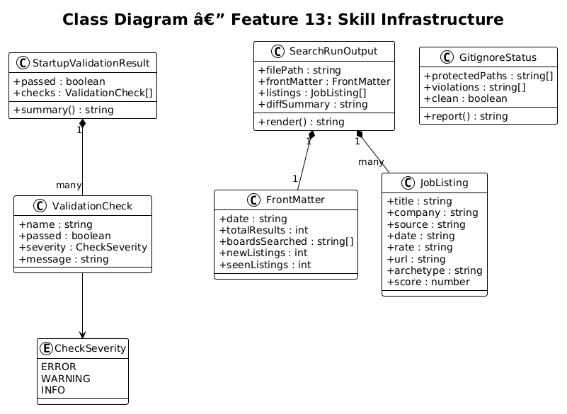
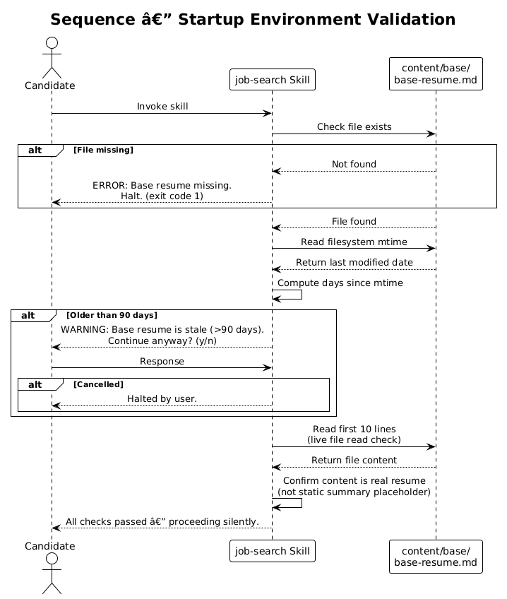
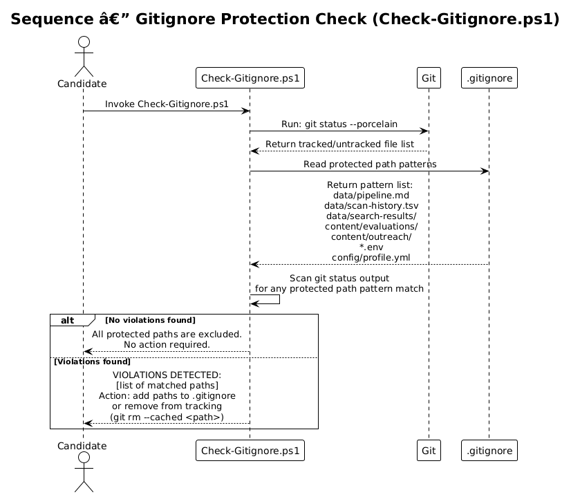

# Feature 13 — Skill Infrastructure: Detailed Design

## 1. Overview

Feature 13 provides foundational infrastructure for the job-search Claude Code skill: startup environment validation, sensitive data exclusion from version control, and standardized machine-parseable output format for search results.

**In-scope requirements:**

| ID | Requirement |
|----|-------------|
| L1-013 | Validate runtime environment at startup: base resume exists, is current, profile data is live. |
| L1-014 | Write each search run's results to a dated file, maintain rolling history, produce diff summary. |
| L1-015 | Protect personal data files from accidental exposure in public repositories. |
| L2-023 | Verify: (a) `content/base/base-resume.md` exists, (b) last modified within 90 days, (c) `data/orbit.db` is reachable and all migrations applied, (d) skill reads actual file at runtime. Fail if missing; warn+prompt if stale; initialize DB if absent. |
| L2-024 | `.gitignore` must exclude: `data/orbit.db`, `data/search-results/`, `content/tailored/`, `content/outreach/`, `content/notes/`, `*.env`, `config/profile.yml`, `resumes/`, `exports/`. These must not appear as tracked or untracked in `git status`. |
| L2-026 | Export output in consistent machine-parseable Markdown generated from DB queries, with YAML front-matter (`date`, `total_results`, `boards_searched`, `new_listings`, `seen_listings`) sourced from `scan_runs` row, and per-listing blocks from `job_listings`. |

**Out of scope:** Remote secrets management, encrypted storage, CI/CD pipeline integration.

---

## 2. Architecture

### 2.1 C4 Context Diagram

The job-search skill validates its own environment before executing any search or evaluation logic. Git and the local filesystem are the only external systems involved.

### 2.2 C4 Container Diagram

The skill's startup validator reads the base resume file and filesystem metadata. The `.gitignore` enforces data exclusion passively. Standardized output is written to `data/search-results/` as dated Markdown files.

### 2.3 C4 Component Diagram

Three independent components handle startup validation, gitignore enforcement checking, and output formatting — each with a clear single responsibility.

---

## 3. Component Details

### Startup Validator (inside job-search skill)

- **Check (a) — File Existence:** Resolves `content/base/base-resume.md`. If missing: emit error and halt with non-zero exit code.
- **Check (b) — Staleness:** Reads filesystem `mtime` of base resume. If older than 90 days from today: emit warning and prompt candidate to confirm continuation. If confirmed, proceed; otherwise halt.
- **Check (c) — Live Read:** Reads the first 10 lines of the file at runtime to confirm it is not a static summary. Proceeds silently if all checks pass.

### Gitignore Enforcer (passive, via `.gitignore`)

- The `.gitignore` file contains entries for all personal data paths (see L2-024).
- A `Check-Gitignore.ps1` utility (optional) can verify none of the protected paths appear in `git status` output.
- No automated repair; the check is advisory — it surfaces violations for manual resolution.

### Output Formatter (inside job-search skill)

- Every search run writes a file: `data/search-results/YYYY-MM-DD.md`.
- File begins with a YAML front-matter block delimited by `---`.
- Front-matter fields: `date`, `total_results`, `boards_searched`, `new_listings`, `seen_listings`.
- Each listing rendered as a Markdown level-3 heading block with labeled fields.
- Diff summary appended at end of file: new listings since previous dated file.

---

## 4. Data Model

### 4.1 Class Diagram

### 4.2 Entity Descriptions

| Entity | Description |
|--------|-------------|
| `StartupValidationResult` | Outcome of all three startup checks. Contains status per check and aggregate pass/fail. |
| `ValidationCheck` | Single check result: name, passed boolean, severity (error/warning), message. |
| `SearchRunOutput` | A single search run result file with front-matter metadata and listing array. |
| `FrontMatter` | YAML front-matter block: date, total_results, boards_searched, new_listings, seen_listings. |
| `JobListing` | Individual job record: title, company, source, date, rate, url, archetype, score. |
| `GitignoreStatus` | Result of checking that protected paths are absent from git tracking. |

---

## 5. Key Workflows

### 5.1 Startup Environment Validation

At skill startup, three sequential checks run against the local filesystem. Failure on check (a) is fatal. Staleness on check (b) prompts the candidate. Check (c) performs a live file read to confirm data freshness. If all pass, the skill proceeds silently.

### 5.2 Gitignore Protection Check

The optional `Check-Gitignore.ps1` script runs `git status` and scans output for any of the protected paths. It reports violations as a list of action items. The `.gitignore` file itself is the primary enforcement mechanism; this check is diagnostic.

---

## 6. Security Considerations

- Personal data files (`data/pipeline.md`, `config/profile.yml`, etc.) are excluded from git tracking via `.gitignore`. Accidental `git add .` commands cannot stage them.
- The startup validator reads the base resume at runtime — not from a cached summary — ensuring no stale PII is used to represent the candidate.
- `*.env` exclusion in `.gitignore` prevents API keys or tokens from being committed.
- The output formatter writes to `data/search-results/` which is also gitignored, preventing search history from leaking company intelligence.

---

## 7. Open Questions

| # | Question | Owner | Status |
|---|----------|-------|--------|
| 1 | Should the 90-day staleness threshold be configurable in `config/profile.yml`? | — | Open |
| 2 | Should `Check-Gitignore.ps1` run automatically as a pre-commit hook? | — | Open |
| 3 | Should the diff summary compare against the previous calendar-day file or the most recent existing file? | — | Open |
| 4 | How many dated result files should be retained before old ones are pruned (rolling window size)? | — | Open |
